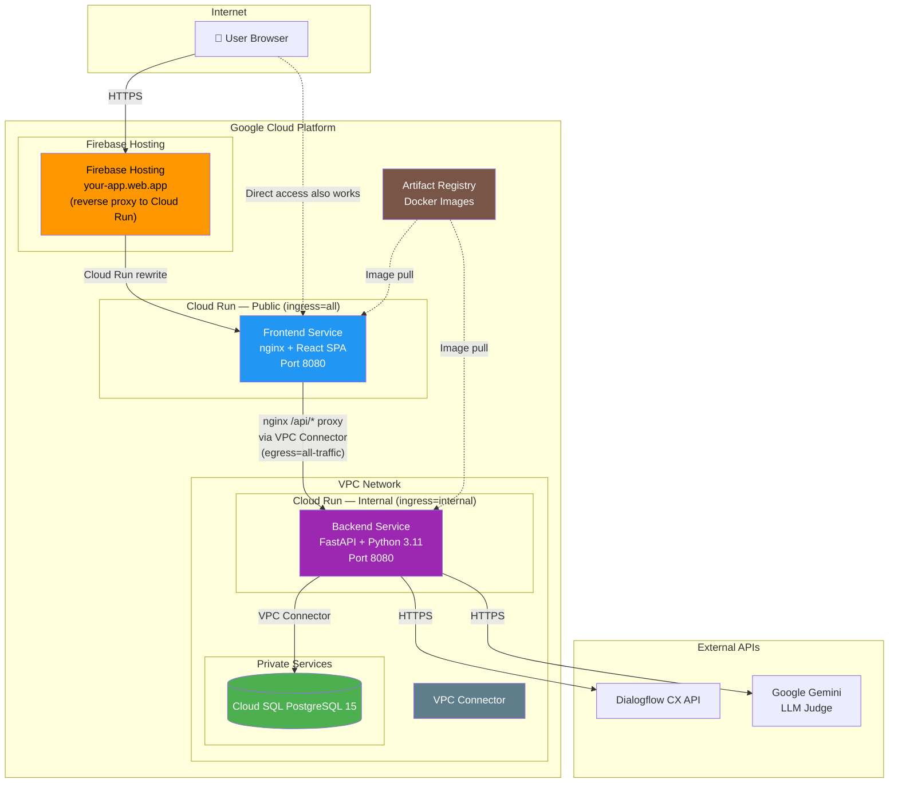
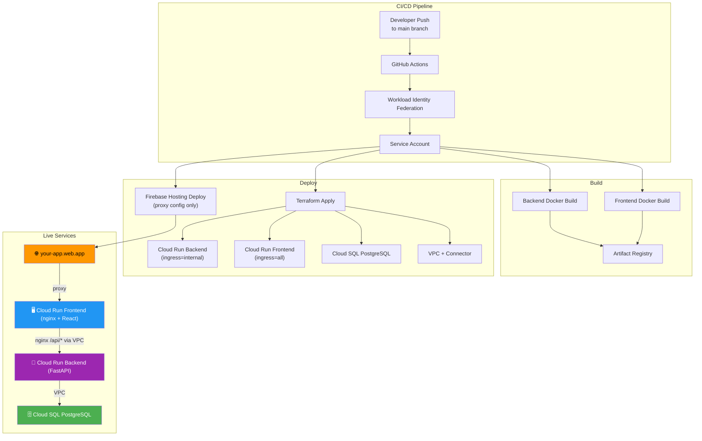

# Dialogflow Test Suite

A platform for testing Dialogflow CX agents with AI-powered evaluation, modern UI, and detailed analytics.

## 📦 **Repository**
- **GitHub**: [dialogflow-test-suite](https://github.com/davearlin/dialogflow-test-suite)
- **Clone**: `git clone https://github.com/your-org/dialogflow-test-suite.git`

## 🌟 **Key Features**

### **Core Functionality**
- ✅ **Dataset Management**: Create, edit, and organize test datasets with direct route access
- ✅ **Advanced Question Management**: Add, edit, and bulk import questions with dedicated full-screen interface
- ✅ **Dynamic Parameter Evaluation**: Revolutionary AI evaluation system with fully configurable parameters (Similarity Score, Empathy Level, No-Match Detection, and custom parameters)
- ✅ **Legacy-Free Evaluation**: New test runs use ONLY dynamic parameter-based scoring - no more hardcoded similarity/empathy fields
- ✅ **Enhanced CSV Exports**: Comprehensive parameter breakdown exports with unlimited parameters including scores, weights, and reasoning
- ✅ **Intelligent HTML Processing**: Automatic detection and optional removal of HTML tags from CSV imports with user-controlled settings
- ✅ **Dynamic Metadata Editing**: Revolutionary key-value pair editor for question metadata (no more raw JSON!)
- ✅ **Advanced Search & Filtering**: Real-time search across questions and test results with live filtering
- ✅ **Table Management**: Complete sorting, pagination, and filtering for large datasets
- ✅ **Dialogflow Testing**: Execute tests against your Dialogflow agents with user-specific access
- ✅ **LLM Judge Integration**: AI-powered response evaluation using Google Gemini 2.0 Flash with weighted parameter scoring
- ✅ **Computed Analytics**: Real-time score computation from parameter weights - no stored legacy scores, full backward compatibility
- ✅ **Project Selection**: Dynamic Google Cloud project selection based on user permissions
- ✅ **Quick Test**: Instantly test prompts against Dialogflow agents with flow/page selection
- ✅ **Enhanced Bulk Import**: Optimized CSV upload workflow with proper column mapping, HTML detection, and file handling
- ✅ **Test Reporting**: View detailed results and analytics with color-coded scoring and parameter visualization
- ✅ **Session Parameters Management**: Centralized management of quick-add session parameters with full CRUD operations
- ✅ **Business Dashboard**: Comprehensive analytics dashboard with performance metrics, trends, and insights for stakeholders

### **Search & Data Management**
- ✅ **Questions Search**: Full-text search across question text, expected answers, tags, and priority
- ✅ **Test Results Search**: Comprehensive search across questions, answers, reasoning, and error messages
- ✅ **Live Filtering**: Real-time search results with instant feedback and smart pagination
- ✅ **Advanced Sorting**: Click-to-sort functionality for all data columns with visual indicators
- ✅ **Configurable Pagination**: 10, 25, 50, 100 results per page with proper result counting
- ✅ **Empty State Handling**: Contextual messages for no results vs no search matches
- ✅ **Performance Optimization**: Memoized filtering and sorting for smooth interactions

### **Modern UI & Navigation**
- ✅ **Arrow-Back Navigation**: Clean, intuitive `←` back buttons replacing complex breadcrumbs
- ✅ **Dark Theme Design**: Professional #121212 dark theme with blue (#0066CC) accents
- ✅ **Vertical Space Optimization**: Maximized content area with consolidated navigation
- ✅ **Consolidated Configuration Accordion**: All test run configuration details (test config, timing, message sequence, session parameters) in a single collapsible section
- ✅ **Two-Column Responsive Layout**: Efficient use of horizontal space with side-by-side configuration display that adapts to screen size
- ✅ **Horizontal Message Display**: Pre/post-prompt messages shown as compact chips with wrapping instead of vertical lists
- ✅ **Full-Screen Editing**: Dedicated pages for complex forms instead of cramped modals
- ✅ **Responsive Layout**: Consistent spacing, padding, and mobile-friendly design
- ✅ **Smart File Handling**: Proper file input reset and state management for re-uploads
- ✅ **Real-time Updates**: Auto-refresh functionality for test run monitoring with live status and results
- ✅ **Enhanced Tables**: Full sorting, pagination, and data display with Material-UI components
- ✅ **Intelligent Auto-Refresh**: Background polling for running test runs with selective row updates
- ✅ **Agent URL Navigation**: Corrected Google Cloud Console links with proper location routing

### **Security & Authentication**
- ✅ **User Authentication**: Google OAuth with individual IAM permission respect
- ✅ **Security Model**: Each user accesses only agents they have permissions for
- ✅ **User Attribution**: Full user tracking with creator information displayed across all test runs and dashboard activity
- ✅ **Creator Visibility**: "Created By" column in test runs showing full name and email of test creator
- ✅ **Dashboard User Context**: Recent activity feed shows user attribution for all test activities
- ✅ **Multi-User Support**: Proper user relationship management with real-time user information display
### **User Preferences & Session Parameters**
- ✅ **Comprehensive Preferences**: Both Quick Test and Create Test Run settings automatically saved and restored
- ✅ **Dialogflow Configuration Memory**: Project, agent, flow, page, and playbook selections preserved across sessions
- ✅ **Session Parameter Persistence**: Custom session parameters remembered for each screen independently
- ✅ **Session Parameters Management**: Centralized management interface for creating, editing, and organizing common session parameters
- ✅ **Quick Add Functionality**: Pre-configured parameter chips for instant addition to test configurations (no duplicates allowed)
- ✅ **Quick Test Preferences**: Project, agent, flow, page, playbook, model, and session parameters saved automatically
- ✅ **Test Run Preferences**: Separate preference system for Create Test Run screen with all Dialogflow Configuration fields
- ✅ **API-Based Storage**: RESTful endpoints for preference management with proper schema validation
- ✅ **Duplicate Prevention**: Smart validation prevents duplicate session parameter keys in both frontend and backend
- ✅ **Generic Configuration**: Flexible key-value session parameters for specialized agent behavior
- ✅ **Type Safety**: Full TypeScript integration with proper schema alignment between frontend and backend

## 🚀 **Quick Start**

### 📖 **For New Developers**
**First time setting up?** See the comprehensive [docs/setup/developer-setup.md](docs/setup/developer-setup.md) guide for detailed step-by-step instructions.

**TL;DR Minimal Setup:**
```powershell
git clone https://github.com/your-org/dialogflow-test-suite.git
cd dialogflow-test-suite

# Configure Google OAuth (required for login)
# Create .env in project root (NOT in backend/ or frontend/)
cp .env.example .env
# Edit .env and add GOOGLE_CLIENT_ID, GOOGLE_CLIENT_SECRET
# See docs/setup/oauth-setup.md for getting OAuth credentials

docker-compose up -d
# Wait 2-3 minutes for first build
# Access: http://localhost:3000
# Login: Use your Google account (all users get admin role by default)
```

### **Prerequisites**
- Docker Desktop installed and running
- PowerShell or Command Prompt
- Google Cloud Platform account with Dialogflow CX access (optional - for testing real agents)

### **Start the Application**
```powershell
cd "C:\Projects\your-workspace\Dialogflow Agent Tester"
docker-compose up -d
```

**The application will automatically:**
- ✅ Build all containers (backend, frontend, database, Redis for local caching)
- ✅ Initialize the database with all required tables and columns
- ✅ Run unified migration system to ensure schema consistency (column additions, complex operations, data backfills)
- ✅ Enable **hot reload** for instant code updates without rebuilds (see Development Workflow below)

**⚠️ IMPORTANT**: This application uses **Google OAuth SSO only** - there is no default admin account. You must configure Google OAuth to login (see Environment Variables Setup below).

### **Access the Application**
- **Frontend**: http://localhost:3000
- **Backend API**: http://localhost:8000
- **API Documentation**: http://localhost:8000/docs
- **Authentication**: Google OAuth via landing page (requires Google Cloud access for full functionality)
- **Webhook Controls**: Both Quick Test and Test Runs include webhook enable/disable toggles (defaults to enabled)

### **Authentication & Setup**
- **Production**: Google OAuth with individual user credentials managed via GitHub Actions
- **Infrastructure**: Fully managed via Terraform with automated deployments
- **Project Access**: Users see only Google Cloud projects they have access to
- **Agent Access**: Users see only Dialogflow agents they have IAM permissions for
- **OAuth Configuration**: Automatically configured via GitHub Actions environment variables
- **Setup Guide**: See `docs/setup/` for comprehensive setup documentation

### **Direct Route Access**
- **Dashboard**: http://localhost:3000/dashboard
- **Dataset Management**: http://localhost:3000/datasets
- **Edit Dataset**: http://localhost:3000/datasets/1/edit
- **Manage Questions**: http://localhost:3000/datasets/1/questions
- **Session Parameters**: http://localhost:3000/session-parameters
- **Quick Test**: http://localhost:3000/quick-test
- **Test Runs**: http://localhost:3000/test-runs

### **Environment Variables Setup (REQUIRED for Login)**

**⚠️ Google OAuth is REQUIRED** - The application uses Google SSO authentication only. You must configure OAuth to login.

**Quick Setup:**
```powershell
# From project root (dialogflow-test-suite/)
cp .env.example .env

# Edit .env and add your values (see below)
```

**Minimal Configuration (Required for Login):**
```bash
# Edit: /.env (project root - NOT /backend/.env or /frontend/.env.local)
# Required for Google OAuth login - YOU MUST HAVE THESE:
GOOGLE_CLIENT_ID=your-client-id.apps.googleusercontent.com
GOOGLE_CLIENT_SECRET=your-client-secret
GOOGLE_REDIRECT_URI=http://localhost:8000/api/v1/auth/google/callback

# Optional - for Dialogflow agent testing:
GOOGLE_CLOUD_PROJECT=your-gcp-project-id
GOOGLE_API_KEY=your-google-api-key-here
```

**Important File Locations:**
- ✅ **`/.env`** (project root) - Used by docker-compose - **THIS IS THE ONE YOU NEED**
- ✅ **`/.env.example`** (project root) - Template with all available variables
- ❌ `/backend/.env` - Only for direct Python development (not needed for Docker)
- ✅ `/frontend/.env.local` - Already configured for local Docker (no changes needed)

**Detailed Setup Guides:**
- 📖 **`docs/setup/oauth-setup.md`** - **START HERE** - How to get OAuth credentials (REQUIRED)
- 📖 **`docs/setup/developer-setup.md`** - Complete first-time setup walkthrough
- 📖 **`docs/setup/google-auth.md`** - Google Cloud project setup (optional - for Dialogflow testing)
- 📖 **`docs/oauth-environment-variables.md`** - Complete environment variable reference
- 📖 **`frontend/ENVIRONMENT_CONFIG.md`** - Frontend-specific environment configuration

**Authentication Flow:**
- ✅ All users login via Google OAuth SSO
- ✅ First-time users are automatically created
- ✅ Other domains get **viewer** role
- ❌ No default accounts exist - OAuth setup is mandatory

### **Stop the Application**
```powershell
docker-compose down
```

## ⚠️ **Important Development Note**
After making code changes, rebuild containers (don't just restart):
```powershell
# ONLY NEEDED for dependency changes (requirements.txt, package.json)
# Code changes now use hot reload - no rebuild required!

# Backend dependency changes
docker-compose build backend && docker-compose up -d backend

# Frontend dependency changes
docker-compose build frontend && docker-compose up -d frontend
```

## 🔥 **Development Workflow with Hot Reload**

**Hot reload is NOW ENABLED!** Code changes appear instantly without Docker rebuilds.

### **How It Works**
- **Backend (Python)**: Uvicorn watches `.py` files → auto-reloads in 1-3 seconds
- **Frontend (React/Vite)**: Vite HMR watches source files → updates browser instantly (<1 sec)
- **Volume Mounts**: Your local code is mounted into containers - saves are live!

### **Daily Workflow**
```powershell
# Start containers ONCE (typically on first boot of the day)
docker-compose up -d

# Edit code in VS Code and save - changes appear automatically!
# No docker commands needed for code changes

# Check logs to see hot reload in action
docker-compose logs -f backend   # Watch Python files reload
docker-compose logs -f frontend  # Watch Vite HMR updates
```

### **When to Rebuild**
You ONLY need `docker-compose build` when changing:
- ✅ Python dependencies (`requirements.txt`)
- ✅ npm packages (`package.json`)
- ✅ Dockerfiles (system packages, environment variables)
- ✅ docker-compose.yml configuration
- ❌ **NOT** for `.py`, `.ts`, `.tsx`, `.css` file changes - hot reload handles these!

### **Testing Hot Reload**
```powershell
# Backend test: Edit any .py file, save, and check logs
docker-compose logs -f backend
# You'll see: "WatchFiles detected changes... Reloading..."

# Frontend test: Edit any React component, save, and watch browser
# Browser updates instantly without refresh!
```

## 📋 **Application Features**

### ✅ **Currently Implemented**
- **User Authentication**: JWT-based with role management and secure access
- **Business Dashboard**: Comprehensive analytics dashboard with performance metrics, trends, and stakeholder insights
- **Dataset Management**: Create, edit, upload and organize test datasets with direct navigation
- **Question Management**: Dedicated interface for adding, editing, and bulk importing questions
- **Test Execution**: Run comprehensive tests against Dialogflow agents
- **Webhook Control**: Enable/disable webhooks for both Quick Test and Test Runs with per-test configuration
- **Results Analysis**: View detailed test outcomes and performance metrics
- **Project Filtering**: Multi-project support with Google Cloud project-based data filtering
- **Direct Routing**: Navigate directly to dataset editing and question management
- **Dark Theme UI**: Modern Material-UI interface with responsive design
- **Real-time Updates**: Auto-refresh functionality for test runs with background polling
- **Agent URL Navigation**: Corrected Google Cloud Console agent links with proper global location
- **API Documentation**: Auto-generated with FastAPI
- **Infrastructure as Code**: Complete Terraform management with automated deployments via GitHub Actions
- **OAuth Management**: Automated OAuth secret management and environment variable handling

### 🔧 **Recent Enhancements & Bug Fixes (September 2025)**
- ✅ **TestRunDetailPage UI Space Optimization (Latest - Sept 30, 2025)**: Consolidated all configuration sections into single collapsible accordion with two-column responsive layout
  - Unified Configuration accordion combines Test Config, Timing, Message Sequence, and Session Parameters
  - Two-column Grid layout (50/50 split on desktop, stacks on mobile) for optimal horizontal space usage
  - Left column: Test Configuration and Timing information
  - Right column: Message Sequence (Pre/Post-Prompt chips) and Session Parameters table
  - Accordion collapsed by default for minimal screen real estate usage (~70% reduction in vertical scrolling)
  - Maintains horizontal chip display for pre/post prompt messages from previous optimization
  - Responsive design automatically adapts to screen size
- ✅ **Preference System Bug Fixes (Sept 26, 2025)**: Fixed critical user preference restoration issues affecting dropdown loading and state persistence
- ✅ **Page Dropdown Loading Fix**: Resolved timing dependency issues where page dropdowns failed to load based on logged-in user preferences on both QuickTest and CreateTestRun pages
- ✅ **Session ID Persistence**: Fixed Session ID field not saving/loading properly on QuickTest page - now correctly saves all values including empty strings
- ✅ **Duplicate API Call Prevention**: Eliminated race conditions causing duplicate page loading API calls and 404 errors by removing conflicting manual loadPages() calls
- ✅ **LLM Model Preference Restoration**: Fixed LLM Model preferences not restoring properly when Playbook is selected on CreateTestRun page by implementing immediate save pattern
- ✅ **Preference Restoration Consistency**: Standardized preference saving across QuickTest and CreateTestRun pages to use immediate onChange saves instead of complex useEffect logic
- ✅ **Debug Logging Cleanup**: Removed all frontend debug console.log statements while preserving essential error handling for production readiness
- ✅ **Duplicate Preference API Calls**: Fixed duplicate PUT calls to preferences API by removing conflicting useEffect hooks that duplicated immediate onChange saves
- ✅ **FastAPI Route Ordering Bug Fixes**: Fixed critical routing issues where `/export` and `/import` endpoints were being interpreted as parameter IDs causing 422 validation errors
- ✅ **CSV Export Standardization**: Created shared `csv_utils.py` module for consistent RFC 4180 compliant CSV escaping across all export functionality
- ✅ **Test Run CSV Export API**: Added dedicated backend endpoint for comprehensive test run CSV export with multi-parameter evaluation breakdown
- ✅ **Authentication Token Standardization**: Fixed frontend authentication to use `access_token` consistently across all export operations and API calls
- ✅ **Route Collision Prevention**: Moved `/export` and `/import` routes before parameterized routes (`/{parameter_id}`) in all parameter management endpoints
- ✅ **Business Dashboard Implementation**: Comprehensive analytics dashboard with overview metrics, performance trends, and agent breakdown
- ✅ **Dashboard Analytics API**: Complete backend API with 5 key endpoints for business insights and performance monitoring
- ✅ **Project-Filtered Analytics**: All dashboard components respect Google Cloud project selection for multi-project environments
- ✅ **Performance Metrics**: Total tests, average scores, success rates, and trend analysis with time-based filtering
- ✅ **Agent Performance Breakdown**: Individual agent scoring and test volume analytics with visual comparisons
- ✅ **Recent Activity Feed**: Real-time test execution tracking with user attribution and timestamp display
- ✅ **Parameter Performance Analysis**: Detailed breakdown of evaluation parameter effectiveness across test runs
- ✅ **Data Scope Indicators**: Clear user context display showing personal vs system-wide data access
- ✅ **Modern Dashboard UI**: Material-UI cards, charts, and responsive layout with dark theme consistency
- ✅ **User Permission Integration**: Dashboard respects user roles (admin, test_manager, viewer) for appropriate data visibility
- ✅ **Webhook Control System**: Implemented webhook enable/disable functionality for both Quick Test and Test Runs with default enabled state
- ✅ **Dialogflow API Integration**: Added QueryParameters.disable_webhook support to DialogflowService with comprehensive backend implementation
- ✅ **UI Controls**: Added Material-UI Switch components for webhook toggle in both QuickTestPage and CreateTestRunPage
- ✅ **Database Schema**: Enhanced TestRun model with enable_webhook column and proper migration support
- ✅ **Pure Dynamic Evaluation System**: Completely eliminated legacy evaluation fields - all scoring is computed from configurable parameters
- ✅ **Enhanced CSV Exports**: Added comprehensive parameter breakdown exports with unlimited parameters including individual scores, weights, and reasoning
- ✅ **Computed Score Display**: UI dynamically computes overall scores from parameter weights - backward compatible with legacy data but future-focused
- ✅ **Backend Schema Updates**: Enhanced API responses with overall_score field and proper parameter data structures
- ✅ **Docker Deployment Improvements**: Streamlined deployment process with full system prune and health checks
- ✅ **Auto-Refresh Fixed**: Test runs page now properly auto-refreshes running/pending tests every 5 seconds
- ✅ **Agent URL Correction**: Fixed agent links to use `/locations/global/` instead of `/locations/us-central1/`
- ✅ **Background Polling**: Implemented efficient Redux action for status updates without full page refresh
- ✅ **API Compatibility**: Fixed backend API calls to handle single status filtering properly

## 🏗️ **Architecture**

### **GCP Infrastructure**



**Key Security Design:**
- The **backend is not publicly accessible** (`ingress=internal`) — all API traffic flows through the frontend's nginx reverse proxy via the VPC connector
- Both frontend and backend Cloud Run services use the **VPC connector** (`egress=all-traffic`) so that frontend→backend traffic is treated as "internal" by Cloud Run
- **Firebase Hosting** provides a clean URL (`*.web.app`) and proxies all requests to the Cloud Run frontend
- The **DNS resolver** inside the VPC-connected frontend container uses `169.254.169.254` (GCE metadata server) since public DNS (8.8.8.8) is unreachable through the VPC connector

### **Technology Stack**
- **Frontend**: React 18 + TypeScript + Material-UI + Redux Toolkit
- **Backend**: FastAPI + Python 3.11 + SQLAlchemy + Celery
- **Database**: PostgreSQL 15
- **Reverse Proxy**: nginx (Cloud Run) + Firebase Hosting (proxy)
- **Session Management**: In-memory sessions (production), Redis (local development)
- **Deployment**: Docker + Docker Compose + GCP Cloud Run + Firebase Hosting

### **Services**
```
Local Development:
  Frontend (React)     → Port 3000  (nginx proxies /api/* to backend)
  Backend (FastAPI)    → Port 8000  
  Database (PostgreSQL)→ Port 5432
  Cache (Redis)        → Port 6379

Production (GCP):
  Firebase Hosting     → your-app.web.app (proxy to Cloud Run)
  Frontend (Cloud Run) → nginx + React SPA, port 8080 (public)
  Backend (Cloud Run)  → FastAPI, port 8080 (internal only, via VPC)
  Database (Cloud SQL)  → PostgreSQL 15 (VPC-connected)
```

## 🎯 **Dynamic Evaluation System**

### **Parameter-Based Scoring**
The application features an evaluation architecture that eliminates hardcoded scoring fields in favor of a fully dynamic, parameter-driven system.

### **System Parameters** 
1. **Similarity Score** (Default weight: 60%) - Semantic similarity between expected and actual responses
2. **Empathy Level** (Default weight: 30%) - Empathetic tone evaluation for customer service contexts  
3. **No-Match Detection** (Default weight: 10%) - Validates appropriate "can't help" responses

### **Custom Parameters**
- ✅ **Unlimited Parameters**: Add custom evaluation criteria (accuracy, completeness, relevance, etc.)
- ✅ **Configurable Weights**: Set parameter importance from 0-100%
- ✅ **Custom Prompts**: Define LLM evaluation instructions for specialized parameters
- ✅ **User-Created Parameters**: Each user can create organization-specific evaluation criteria

### **Technical Implementation**
```sql
-- Legacy (deprecated, nullable)
similarity_score: INTEGER NULL  
empathy_score: INTEGER NULL
overall_score: INTEGER NULL

-- New dynamic system (primary)
TestResultParameterScore {
  parameter_id: INTEGER (FK to EvaluationParameter)
  score: INTEGER (0-100)
  weight_used: INTEGER (0-100) 
  reasoning: TEXT
}
```

### **UI Computation**
```typescript
// Real-time score calculation
const overallScore = parameterScores.reduce((total, ps) => 
  total + (ps.score * ps.weight_used), 0
) / parameterScores.reduce((total, ps) => total + ps.weight_used, 0)
```

## 📁 **Project Structure**

```
Dialogflow Agent Tester/
├── .agents/                    # AI agent context and handoff docs
├── .github/workflows/          # CI/CD pipeline configuration
├── backend/                    # FastAPI Python backend
│   ├── app/
│   │   ├── api/               # API route handlers
│   │   ├── core/              # Configuration and database
│   │   ├── models/            # SQLAlchemy models and schemas
│   │   ├── services/          # Business logic services
│   │   └── main.py           # FastAPI application entry
│   ├── sql/                   # Database scripts and migrations
│   ├── Dockerfile
│   └── requirements.txt
├── design/                     # Architecture and design documentation
├── docs/                       # User and setup documentation
│   ├── setup/                 # Setup guides (developer, GitHub, auth)
│   ├── guides/                # User guides and tutorials
│   └── README.md             # Documentation index
├── frontend/                   # React TypeScript frontend
│   ├── src/
│   │   ├── components/        # React components
│   │   ├── pages/            # Page components
│   │   ├── store/            # Redux store and slices
│   │   └── App.tsx           # Main React app
│   ├── Dockerfile
│   └── package.json
├── terraform/                  # Infrastructure as Code (GCP)
├── test-data/                  # CSV files for testing
├── docker-compose.yml          # Local development containers
├── PRODUCTION_DEPLOYMENT.md    # Live production infrastructure details
└── README.md                  # This file - project overview
```

## 🔧 **Development**

### **Check Service Status**
```powershell
docker-compose ps
```

### **View Logs**
```powershell
# All services
docker-compose logs

# Specific service
docker-compose logs backend
docker-compose logs frontend
```

### **Rebuild After Changes**
```powershell
# Specific service
docker-compose build backend
docker-compose up -d backend

# All services
docker-compose build
docker-compose up -d
```

### **Database Access**
```powershell
docker exec -it agent-evaluator-db psql -U postgres -d agent_evaluator
```

## 🧪 **Testing & Quality Assurance**

### **Automated Testing Pipeline**
- ✅ **Backend Unit Tests**: 11 comprehensive tests covering CSV utilities and core functionality
- ✅ **Frontend Unit Tests**: Vitest-based testing for React components and utilities  
- ✅ **CI/CD Integration**: Automated testing on every push to main and pull requests
- ✅ **Quality Gates**: Tests must pass before deployment to production

### **Running Tests Locally**

**Backend Tests:**
```powershell
cd backend
python -m pytest tests/ --no-header -v
```

**Frontend Tests:**
```powershell
cd frontend
npm test
```

**All Tests:**
```powershell
# Backend
cd backend && python -m pytest tests/ --no-header -v

# Frontend  
cd frontend && npm test
```

### **Test Coverage**
- **Backend**: CSV utilities, mock infrastructure, data validation
- **Frontend**: Basic functionality, component rendering, utility functions
- **Integration**: API endpoints validated through CI/CD pipeline

### **CI/CD Pipeline Behavior**
- **Documentation-only changes**: Pipeline skips unnecessary builds (*.md, docs/, design/)
- **Code changes**: Full test suite runs before deployment
- **Pull Requests**: Tests run without deployment 
- **Main branch pushes**: Tests run followed by automated deployment

## 🌐 **API Endpoints**

### **Authentication**
- `POST /auth/register` - User registration
- `POST /auth/login` - User login
- `GET /auth/me` - Get current user

### **Datasets**
- `GET /datasets/` - List datasets
- `POST /datasets/` - Create dataset
- `POST /datasets/{id}/upload` - Upload dataset file
- `GET /datasets/{id}` - Get dataset details

### **Test Runs**
- `GET /test-runs/` - List test runs
- `POST /test-runs/` - Create test run
- `POST /test-runs/{id}/execute` - Execute test run
- `GET /test-runs/{id}` - Get test run details

### **Results**
- `GET /results/` - List test results
- `GET /results/test-run/{id}` - Get results for test run
- `GET /results/{id}` - Get specific result

### **Health**
- `GET /health` - Service health check

## 🔐 **Configuration**

### **Environment Variables**
```yaml
# Database
POSTGRES_SERVER=postgres
POSTGRES_USER=postgres
POSTGRES_PASSWORD=password
POSTGRES_DB=agent_evaluator

# Authentication
SECRET_KEY=your-super-secret-key-change-this-in-production

# Google Cloud (for production)
GOOGLE_CLOUD_PROJECT=your-gcp-project-id

# Redis (local development only - production uses in-memory sessions)
REDIS_URL=redis://redis:6379
```

## 🚀 **Deployment**

### **Local Development**
Using Docker Compose for local development and testing.

### **Sandbox Deployment - Google Cloud Platform** ✅ **LIVE & OPERATIONAL**
✅ **Active CI/CD Pipeline**: Complete GitHub Actions workflow with Workload Identity Federation  
✅ **Infrastructure Deployed**: Terraform-managed infrastructure on GCP  
✅ **Secure Authentication**: No service account keys - uses WIF for GitHub Actions  
✅ **Database Operational**: PostgreSQL with auto-generated secure passwords  
✅ **Redis Removed**: Cost optimization - removed Redis cache (~$26/month savings)  
✅ **OAuth Integration**: Google OAuth working with proper redirect URLs  
✅ **API Endpoints**: All frontend API calls use centralized service pattern  

#### **Current GCP Sandbox Architecture** 
- **🌐 Firebase Hosting**: `https://your-frontend-url.web.app` (proxy to Cloud Run frontend)
- **🖥️ Cloud Run Frontend**: nginx + React SPA (`ingress=all`)
- **🚀 Cloud Run Backend**: FastAPI + Python (`ingress=internal`, not publicly accessible)
- **🗄️ Cloud SQL PostgreSQL**: `dialogflow-tester-postgres-dev` with backup configuration
- **🔐 VPC Networking**: Private network with VPC connector on both frontend and backend Cloud Run services
- **🔑 Workload Identity Federation**: `github-actions-dialogflow@your-gcp-project-id` service account
- **🌍 Multi-Environment**: Dev environment operational

#### **Recent Infrastructure Changes (February 2026)**
- ✅ **Backend Security**: Backend Cloud Run set to `ingress=internal` — no longer publicly exposed on ports 80/443
- ✅ **Frontend on Cloud Run**: Moved frontend from Firebase static hosting to Cloud Run with nginx reverse proxy
- ✅ **Firebase Hosting Proxy**: Firebase Hosting now proxies to Cloud Run frontend (clean `*.web.app` URL preserved)
- ✅ **VPC Connector on Frontend**: Frontend uses VPC connector (`egress=all-traffic`) so proxy traffic to backend is "internal"
- ✅ **Internal DNS Resolution**: nginx uses `169.254.169.254` (GCE metadata DNS) since public DNS is unreachable through VPC

#### **Previous Infrastructure Changes (September 2025)**
- ✅ **Redis Removal**: Eliminated Redis dependency for cost savings (~$26/month)
- ✅ **Session Management**: Backend now uses in-memory sessions (suitable for single-instance)
- ✅ **OAuth Fixes**: Resolved authentication redirects and token management
- ✅ **API Consistency**: Fixed "Failed to construct 'URL'" errors across frontend
- ✅ **Terraform Updates**: Infrastructure as code properly maintained and deployed

#### **Deployment Status**
**✅ Fully Operational:**
- Project: `your-gcp-project-id`
- Backend Service: Healthy and responding
- Frontend Application: Deployed and accessible
- Database: Operational with secure connections
- OAuth: Working with Google authentication

#### **GCP Architecture & Deployment Flow**


#### **Deployment Options**

**Option 1: Automated GitHub Actions (Recommended) ✅ READY**
```bash
# Repository secrets configured:
# - WIF_PROVIDER
# - WIF_SERVICE_ACCOUNT  
# - GCP_PROJECT_ID_DEV
git add . && git commit -m "Deploy infrastructure" && git push
# Monitor deployment: https://github.com/your-org/dialogflow-test-suite/actions
```

**Option 2: Manual Terraform Deployment ✅ AVAILABLE**
```bash
cd terraform
terraform plan -var-file="terraform.tfvars.dev"
terraform apply -var-file="terraform.tfvars.dev"
```

#### **Setup Guides**
- **`WORKLOAD_IDENTITY_SETUP_COMPLETE.md`** - GitHub Actions authentication setup
- **`GCP_ADMIN_SETUP_GUIDE.md`** - GCP administrator configuration
- **`.agents/deployment-guide.md`** - Comprehensive deployment instructions
- **`GOOGLE_OAUTH_SETUP.md`** - OAuth application configuration

#### **Cost Optimization**
Development environment configured for <5 users with minimal resource allocation:
- **Cloud SQL**: db-f1-micro (shared CPU, 0.6GB RAM)
- **Cloud Run**: Pay-per-request with automatic scaling
- **Session Management**: In-memory sessions (no external cache required)
- **Total Cost Savings**: ~$26/month (Redis removal)

## 🐛 **Troubleshooting**

### **Common Issues**

#### **Containers Won't Start**
```powershell
# Check Docker Desktop is running
docker-compose down
docker-compose up -d

# Check logs
docker-compose logs
```

#### **API Connection Issues**
If you encounter errors loading data or "Can't connect to API" messages:

1. **Check Frontend Container Logs**:
   ```powershell
   docker-compose logs frontend
   ```

2. **Check Backend Container Logs**:
   ```powershell
   docker-compose logs backend
   ```

3. **Verify API Endpoints**:
   - API should be accessible at: http://localhost:8000
   - API docs should load at: http://localhost:8000/docs
   - Frontend should be at: http://localhost:3000

4. **Test Internal Container Communication**:
   ```powershell
   # Test if backend is accessible from frontend container
   docker-compose exec frontend curl http://backend:8000/api/v1/datasets/
   ```

5. **Common API Configuration Issues**:
   - ❌ **Wrong**: Hardcoded `http://localhost:8000` in frontend API calls
   - ✅ **Correct**: Relative URLs (empty `baseURL` in axios)
   - ❌ **Wrong**: Missing trailing slash `/api/v1/datasets` → causes 307 redirects
   - ✅ **Correct**: Proper trailing slash `/api/v1/datasets/` → direct 200 response

#### **Database Connection Issues**
```powershell
# Reset database
docker-compose down -v
docker-compose up -d
```

#### **Port Conflicts**
Ensure ports 3000, 8000, 5432, and 6379 are available.

## 📊 **Testing**

### **Test Data**
The application includes sample data structure for testing. The CSV bulk upload feature provides a dedicated page experience with column mapping capabilities:

**CSV Bulk Upload Process:**
1. Navigate to any dataset's "Manage Questions" page
2. Click "Bulk Add Questions" to open the dedicated upload page
3. Select "Upload CSV File" mode 
4. Choose your CSV file and preview the data
5. Map your CSV columns to question fields using the interactive interface
6. Import questions with proper authentication and error handling

**CSV File Format:** Upload CSV files with the following format:
```csv
question,expected_intent,expected_entities
"What is my balance?",account.balance,"{""account_type"": ""checking""}"
"Transfer $100",money.transfer,"{""amount"": ""100""}"
```

**HTML Content Processing:** The application automatically detects HTML content in CSV files and provides intelligent processing options:
- **Smart Detection**: Analyzes rows to identify HTML tags in your data
- **User Choice**: Provides options to automatically strip HTML tags while preserving text content
- **Safe Processing**: Uses BeautifulSoup4 for reliable HTML parsing and tag removal
- **Focused Interface**: Shows HTML removal options only for selected Question and Answer columns
- **Large Dataset Support**: Optimized for handling CSV files with thousands of rows efficiently

##  **Documentation**

### **Setup & Configuration**
- **[📖 Documentation Index](docs/README.md)** - Complete documentation navigation
- **[🚀 Developer Setup](docs/setup/developer-setup.md)** - Complete setup guide for new developers
- **[🔧 GitHub Setup](docs/setup/github-setup.md)** - Repository and CI/CD configuration
- **[🔐 Google Cloud Auth](docs/setup/google-auth.md)** - Authentication configuration
- **[🔑 OAuth Setup](docs/setup/oauth-setup.md)** - OAuth configuration

### **User Guides**
- **[⚡ Quick Testing](docs/guides/quick-testing.md)** - How to quickly test features
- **[📝 Scripts Documentation](scripts/README.md)** - Automation and utility scripts

### **Technical Documentation**
- **[🏗️ Architecture & Design](design/README.md)** - System architecture and design documents  
- **[🚀 Production Deployment](PRODUCTION_DEPLOYMENT.md)** - Live production infrastructure details
- **[🤖 AI Agent Context](.agents/README.md)** - Agent handoff and technical context

## 🤝 **Contributing**

1. Follow the existing code structure and patterns
2. Maintain TypeScript types and Python type hints
3. Use the Material-UI dark theme for UI consistency
4. Test changes locally with Docker before deployment
5. Update documentation when adding new features

---

**Need Help?** Check the comprehensive documentation in the `.agents/` folder for detailed setup and troubleshooting guides.

### 4. Start Application
```bash
docker-compose up -d
```

### 5. Access Application
- **Frontend**: http://localhost:3000
- **Backend API**: http://localhost:8000
- **API Docs**: http://localhost:8000/docs

## Development Setup

### Backend Development
```bash
cd backend

# Create virtual environment
python -m venv venv
source venv/bin/activate  # On Windows: venv\Scripts\activate

# Install dependencies
pip install -r requirements.txt

# Set up environment
cp .env.example .env
# Edit .env with your settings

# Initialize database
python app/init_db.py

# Start development server
uvicorn app.main:app --reload --port 8000
```

### Frontend Development
```bash
cd frontend

# Install dependencies
npm install

# Start development server
npm run dev
```

## Architecture Overview

### Backend Components
```
app/
├── api/           # FastAPI route handlers
├── core/          # Configuration, database, security, migrations
│   ├── migrations.py           # MigrationManager - unified orchestrator
│   └── migration_files/        # Complex migration operations
│       ├── add_quick_add_parameters_table.py
│       └── make_evaluation_model_required.py
├── models/        # SQLAlchemy models and Pydantic schemas
├── services/      # Business logic (Dialogflow, LLM, testing)
└── main.py        # FastAPI application entry point
```

### Database Migration System

The application uses a **unified migration system** orchestrated by `MigrationManager` in `backend/app/core/migration_manager.py`:

**Architecture:**
- **Single Entry Point**: All migrations run automatically on application startup via `MigrationManager.run_migrations()`
- **Three Migration Types**:
  1. **Column Additions**: Inline tuples in MigrationManager for simple `ALTER TABLE ADD COLUMN` operations
  2. **Function Handlers**: Complex migrations in `migration_files/` (CREATE TABLE, constraints, indexes)
  3. **Data Migrations**: Inline SQL lists for UPDATE queries with automatic row count logging

**Key Features:**
- ✅ **Idempotent**: Safe to run multiple times, automatically skips already-applied changes
- ✅ **Error Handling**: Gracefully handles "already exists", permission errors, missing tables
- ✅ **Timeout Support**: Optional timeout for long-running migrations using threading
- ✅ **Fresh Deployment**: Individual migration files preserved for new environment initialization
- ✅ **Automatic Execution**: Runs on every application startup, no manual intervention needed

**Example Migration Patterns:**
```python
# Column Addition (inline in MigrationManager.migrations list)
{
    'name': 'add_new_columns',
    'description': 'Add new feature columns',
    'columns': [
        ('table_name', 'column_name', 'TEXT')
    ]
}

# Complex Operation (function handler from migration_files/)
{
    'name': 'create_new_table',
    'description': 'Create table with indexes',
    'type': 'function',
    'handler': create_new_table_handler,
    'timeout': 60
}

# Data Backfill (inline SQL in MigrationManager.migrations list)
{
    'name': 'backfill_field',
    'description': 'Set default values',
    'type': 'data',
    'sql': [
        "UPDATE table_name SET field = 0 WHERE field IS NULL"
    ]
}
```

**Location**: `backend/app/core/migration_manager.py` (orchestrator) + `backend/app/core/migration_files/` (complex operations)

### Frontend Components
```
src/
├── components/    # Reusable UI components
├── pages/         # Page components
├── store/         # Redux store and slices
├── services/      # API client and utilities
├── types/         # TypeScript type definitions
└── hooks/         # Custom React hooks
```

## API Endpoints

### Authentication
- `POST /api/v1/auth/login` - User login
- `GET /api/v1/auth/me` - Get current user
- `POST /api/v1/auth/register` - Register new user

### Datasets
- `GET /api/v1/datasets` - List datasets
- `POST /api/v1/datasets` - Create dataset
- `GET /api/v1/datasets/{id}` - Get dataset details
- `POST /api/v1/datasets/{id}/import` - Import questions from file

### Test Runs
- `GET /api/v1/tests` - List test runs
- `POST /api/v1/tests` - Create and start test run
- `GET /api/v1/tests/{id}` - Get test run details
- `GET /api/v1/tests/{id}/results` - Get test results

### Dialogflow
- `GET /api/v1/dialogflow/agents` - List available agents
- `GET /api/v1/dialogflow/agents/{agent}/flows` - List flows
- `GET /api/v1/dialogflow/flows/{flow}/pages` - List pages

## Configuration

### Environment Variables

#### Backend (.env)
```bash
# Security
SECRET_KEY=your-super-secret-key

# Database
POSTGRES_SERVER=localhost
POSTGRES_USER=postgres
POSTGRES_PASSWORD=password
POSTGRES_DB=agent_evaluator

# Redis (local development only)
REDIS_URL=redis://localhost:6379

# Google Cloud
GOOGLE_CLOUD_PROJECT=your-project-id

# File Upload
UPLOAD_DIR=uploads
MAX_FILE_SIZE=52428800

# CORS
BACKEND_CORS_ORIGINS=http://localhost:3000,http://localhost:5173
```

### Google Cloud Setup

1. **Enable APIs**:
   - Dialogflow CX API
   - AI Platform API
   - Cloud Storage API (optional)

2. **Create Service Account**:
   ```bash
   gcloud iam service-accounts create dialogflow-tester \
     --display-name="Dialogflow Agent Tester"
   ```

3. **Grant Permissions**:
   ```bash
   gcloud projects add-iam-policy-binding PROJECT_ID \
     --member="serviceAccount:dialogflow-tester@PROJECT_ID.iam.gserviceaccount.com" \
     --role="roles/dialogflow.reader"
   
   gcloud projects add-iam-policy-binding PROJECT_ID \
     --member="serviceAccount:dialogflow-tester@PROJECT_ID.iam.gserviceaccount.com" \
     --role="roles/aiplatform.user"
   ```

4. **Download Key**:
   ```bash
   gcloud iam service-accounts keys create service-account.json \
     --iam-account=dialogflow-tester@PROJECT_ID.iam.gserviceaccount.com
   ```

## Dataset Import Format

### CSV Format
The new CSV bulk upload feature provides an intuitive column mapping interface. Your CSV can have any column names - the application will let you map them to the required fields during import:

```csv
question,answer,detect_empathy,no_match,priority,tags
"How do I reset my password?","You can reset your password by...",false,false,high,"password,security"
"What is the weather like?","I can't help with weather information",false,true,low,"weather,no-match"
```

**Column Mapping Support:**
- **Required**: Question and Answer columns
- **Optional**: Empathy detection, No-match flag, Priority level, Tags
- **Flexible**: Any CSV column names can be mapped during the import process

### JSON Format
```json
[
  {
    "question": "How do I reset my password?",
    "answer": "You can reset your password by...",
    "detect_empathy": false,
    "no_match": false,
    "priority": "high",
    "tags": ["password", "security"]
  }
]
```

## Testing

### Backend Tests
```bash
cd backend
pytest
```

### Frontend Tests
```bash
cd frontend
npm test
```

### Integration Tests
```bash
# Start services
docker-compose up -d

# Run integration tests
# (Add your integration test commands here)
```

## Monitoring and Logging

### Health Checks
- **Backend**: `GET /health`
- **Database**: Automated health checks in Docker Compose
- **Session Management**: In-memory (production) / Redis monitoring (local development)

### Logging
- Application logs: stdout/stderr
- Error tracking: Built-in FastAPI error handling
- Request logging: Configurable via FastAPI middleware

## Security Considerations

### Production Deployment
1. **Change Default Credentials**: Update admin password immediately
2. **Environment Variables**: Use secure secret management
3. **HTTPS**: Configure SSL/TLS certificates
4. **Database Security**: Restrict database access
5. **API Rate Limiting**: Implement rate limiting middleware
6. **CORS**: Configure appropriate CORS origins

### Authentication
- JWT tokens with configurable expiration
- Secure password hashing with bcrypt
- Role-based access control
- Session management: In-memory sessions (production), Redis sessions (local development)

## Troubleshooting

### Common Issues

1. **Google Cloud Authentication**:
   ```bash
   # Verify service account key
   gcloud auth activate-service-account --key-file=service-account.json
   ```

2. **Database Connection**:
   ```bash
   # Check PostgreSQL is running
   docker-compose ps postgres
   ```

3. **Redis Connection** (Local Development):
   ```powershell
   # Test Redis connectivity (local environment only)
   docker-compose exec redis redis-cli ping
   ```

4. **Frontend Build Issues**:
   ```powershell
   # Clear node modules and reinstall
   cd frontend
   Remove-Item -Recurse -Force node_modules, package-lock.json
   npm install
   ```

### Logs
```powershell
# View all logs
docker-compose logs -f

# View specific service logs
docker-compose logs -f backend
docker-compose logs -f frontend
```

## 🚧 **Current Development Status**

### **Active Work (September 2025)**
We are currently working on improving user experience and preference persistence:

#### **Recently Completed**
- ✅ **Flows API Fixes**: Resolved 500 errors in Dialogflow flows endpoint
- ✅ **Batch Size Preferences**: Complete persistence implementation for test run batch sizes
- ✅ **Infinite Loop Fixes**: Eliminated useEffect dependency cycles causing re-rendering issues
- ✅ **Enhanced Debugging**: Comprehensive logging system for preference management

## Contributing

### Development Workflow
1. Create feature branch
2. Make changes with tests
3. Submit pull request

### Code Standards
- **Backend**: Black formatter, Pylint, type hints
- **Frontend**: ESLint, Prettier, TypeScript strict mode
- **Commits**: Conventional commit messages
