# Application Flow Diagrams - Dialogflow Test Suite

## User Authentication Flow

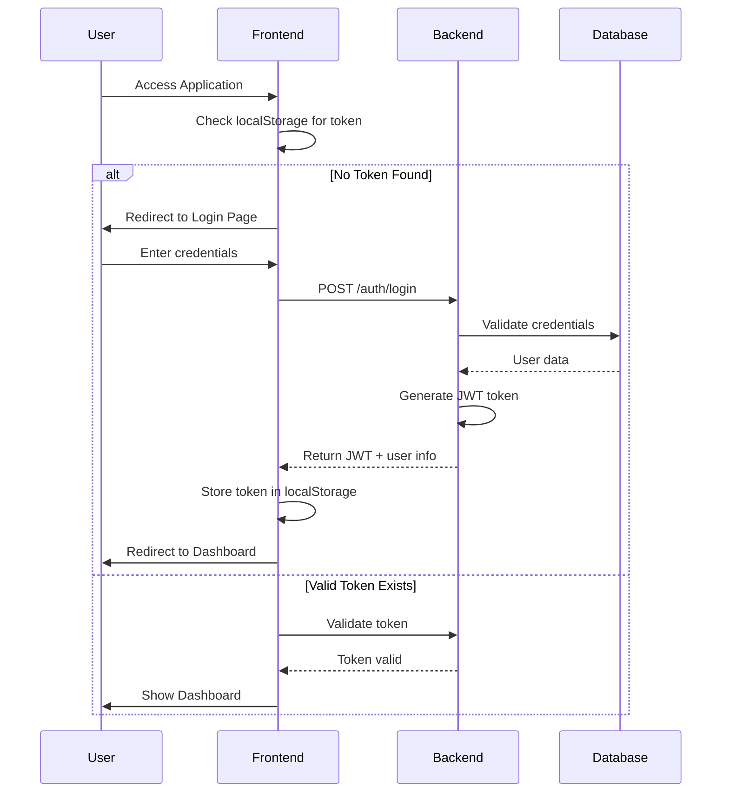
```mermaid
sequenceDiagram
    participant U as User
    participant FE as Frontend
    participant BE as Backend
    participant DB as Database
    
    U->>FE: Access Application
    FE->>FE: Check localStorage for token
    
    alt No Token Found
        FE->>U: Redirect to Login Page
        U->>FE: Enter credentials
        FE->>BE: POST /auth/login
        BE->>DB: Validate credentials
        DB-->>BE: User data
        BE->>BE: Generate JWT token
        BE-->>FE: Return JWT + user info
        FE->>FE: Store token in localStorage
        FE->>U: Redirect to Dashboard
    else Valid Token Exists
        FE->>BE: Validate token
        BE-->>FE: Token valid
        FE->>U: Show Dashboard
    end
```

## Dataset Management Flow

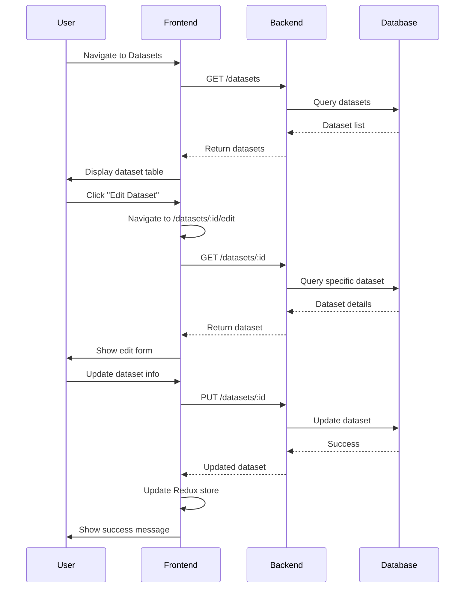
```mermaid
sequenceDiagram
    participant U as User
    participant FE as Frontend
    participant BE as Backend
    participant DB as Database
    
    U->>FE: Navigate to Datasets
    FE->>BE: GET /datasets
    BE->>DB: Query datasets
    DB-->>BE: Dataset list
    BE-->>FE: Return datasets
    FE->>U: Display dataset table
    
    U->>FE: Click "Edit Dataset"
    FE->>FE: Navigate to /datasets/:id/edit
    FE->>BE: GET /datasets/:id
    BE->>DB: Query specific dataset
    DB-->>BE: Dataset details
    BE-->>FE: Return dataset
    FE->>U: Show edit form
    
    U->>FE: Update dataset info
    FE->>BE: PUT /datasets/:id
    BE->>DB: Update dataset
    DB-->>BE: Success
    BE-->>FE: Updated dataset
    FE->>FE: Update Redux store
    FE->>U: Show success message
```

## Question Management Flow

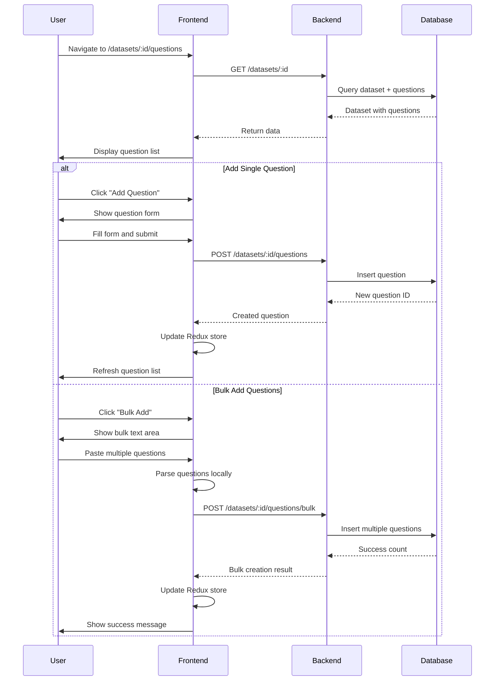
```mermaid
sequenceDiagram
    participant U as User
    participant FE as Frontend
    participant BE as Backend
    participant DB as Database
    
    U->>FE: Navigate to /datasets/:id/questions
    FE->>BE: GET /datasets/:id
    BE->>DB: Query dataset + questions
    DB-->>BE: Dataset with questions
    BE-->>FE: Return data
    FE->>U: Display question list
    
    alt Add Single Question
        U->>FE: Click "Add Question"
        FE->>U: Show question form
        U->>FE: Fill form and submit
        FE->>BE: POST /datasets/:id/questions
        BE->>DB: Insert question
        DB-->>BE: New question ID
        BE-->>FE: Created question
        FE->>FE: Update Redux store
        FE->>U: Refresh question list
    else Bulk Add Questions
        U->>FE: Click "Bulk Add"
        FE->>U: Show bulk text area
        U->>FE: Paste multiple questions
        FE->>FE: Parse questions locally
        FE->>BE: POST /datasets/:id/questions/bulk
        BE->>DB: Insert multiple questions
        DB-->>BE: Success count
        BE-->>FE: Bulk creation result
        FE->>FE: Update Redux store
        FE->>U: Show success message
    end
```

## CSV Bulk Upload Flow

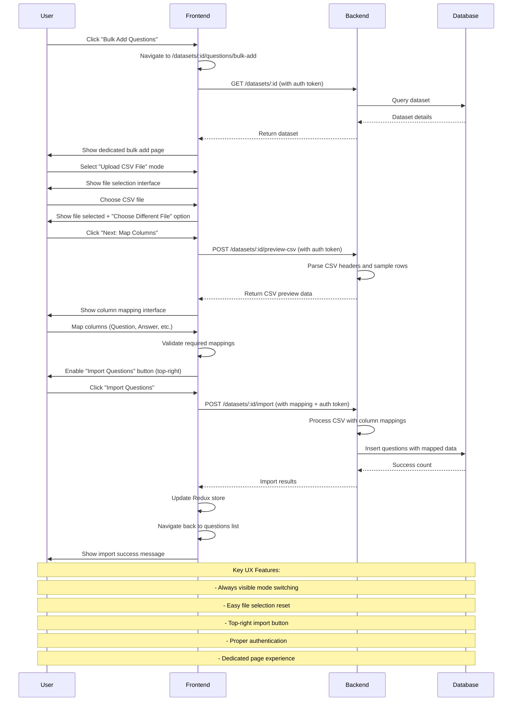
```mermaid
sequenceDiagram
    participant U as User
    participant FE as Frontend
    participant BE as Backend
    participant DB as Database
    
    U->>FE: Click "Bulk Add Questions"
    FE->>FE: Navigate to /datasets/:id/questions/bulk-add
    FE->>BE: GET /datasets/:id (with auth token)
    BE->>DB: Query dataset
    DB-->>BE: Dataset details
    BE-->>FE: Return dataset
    FE->>U: Show dedicated bulk add page
    
    U->>FE: Select "Upload CSV File" mode
    FE->>U: Show file selection interface
    U->>FE: Choose CSV file
    FE->>U: Show file selected + "Choose Different File" option
    
    U->>FE: Click "Next: Map Columns"
    FE->>BE: POST /datasets/:id/preview-csv (with auth token)
    BE->>BE: Parse CSV headers and sample rows
    BE-->>FE: Return CSV preview data
    FE->>U: Show column mapping interface
    
    U->>FE: Map columns (Question, Answer, etc.)
    FE->>FE: Validate required mappings
    FE->>U: Enable "Import Questions" button (top-right)
    
    U->>FE: Click "Import Questions"
    FE->>BE: POST /datasets/:id/import (with mapping + auth token)
    BE->>BE: Process CSV with column mappings
    BE->>DB: Insert questions with mapped data
    DB-->>BE: Success count
    BE-->>FE: Import results
    FE->>FE: Update Redux store
    FE->>FE: Navigate back to questions list
    FE->>U: Show import success message
    
    Note over U,DB: Key UX Features:
    Note over U,DB: - Always visible mode switching
    Note over U,DB: - Easy file selection reset
    Note over U,DB: - Top-right import button
    Note over U,DB: - Proper authentication
    Note over U,DB: - Dedicated page experience
```

## Test Execution Flow (Multi-Parameter Evaluation)

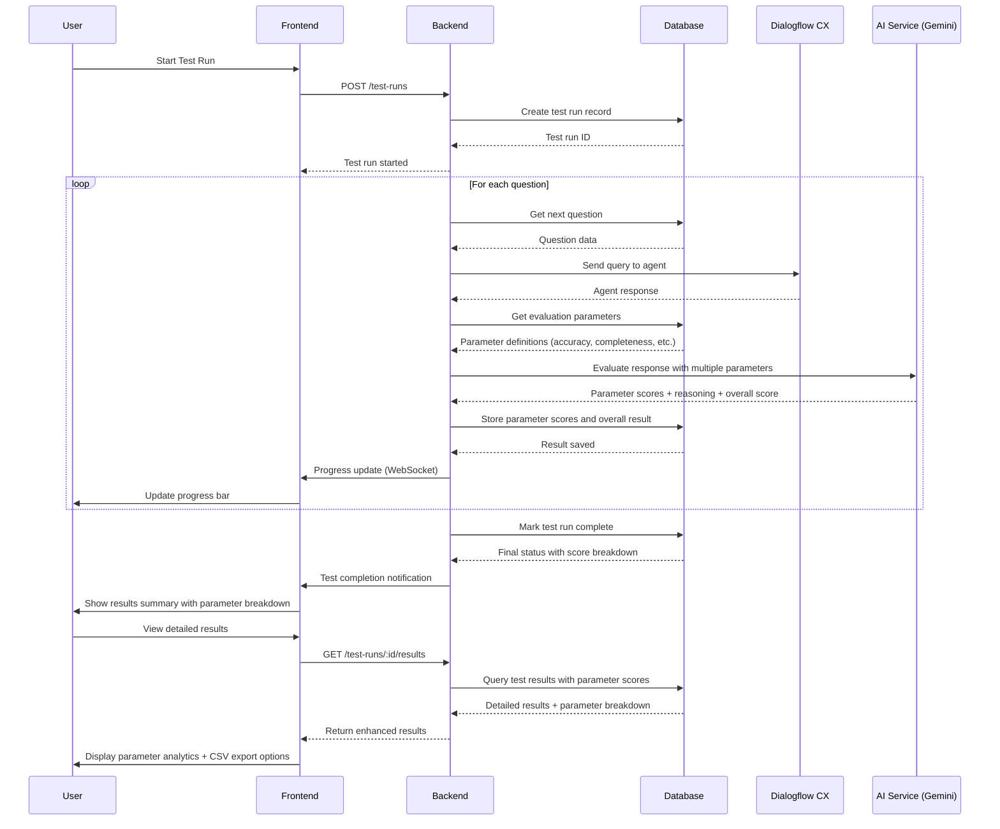
```mermaid
sequenceDiagram
    participant U as User
    participant FE as Frontend
    participant BE as Backend
    participant DB as Database
    participant DF as Dialogflow CX
    participant AI as AI Service (Gemini)
    
    U->>FE: Start Test Run
    FE->>BE: POST /test-runs
    BE->>DB: Create test run record
    DB-->>BE: Test run ID
    BE-->>FE: Test run started
    
    loop For each question
        BE->>DB: Get next question
        DB-->>BE: Question data
        BE->>DF: Send query to agent
        DF-->>BE: Agent response
        
        BE->>DB: Get evaluation parameters
        DB-->>BE: Parameter definitions (accuracy, completeness, etc.)
        BE->>AI: Evaluate response with multiple parameters
        AI-->>BE: Parameter scores + reasoning + overall score
        BE->>DB: Store parameter scores and overall result
        
        DB-->>BE: Result saved
        BE->>FE: Progress update (WebSocket)
        FE->>U: Update progress bar
    end
    
    BE->>DB: Mark test run complete
    DB-->>BE: Final status with score breakdown
    BE->>FE: Test completion notification
    FE->>U: Show results summary with parameter breakdown
    
    U->>FE: View detailed results
    FE->>BE: GET /test-runs/:id/results
    BE->>DB: Query test results with parameter scores
    DB-->>BE: Detailed results + parameter breakdown
    BE-->>FE: Return enhanced results
    FE->>U: Display parameter analytics + CSV export options
```

## Quick Test Flow (Flow and Playbook Support)

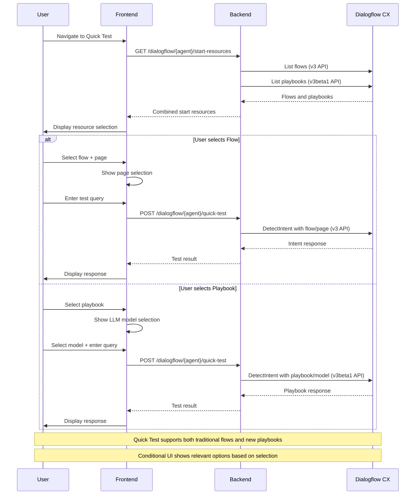
```mermaid
sequenceDiagram
    participant U as User
    participant FE as Frontend
    participant BE as Backend
    participant DF as Dialogflow CX
    
    U->>FE: Navigate to Quick Test
    FE->>BE: GET /dialogflow/{agent}/start-resources
    BE->>DF: List flows (v3 API)
    BE->>DF: List playbooks (v3beta1 API)
    DF-->>BE: Flows and playbooks
    BE-->>FE: Combined start resources
    FE->>U: Display resource selection
    
    alt User selects Flow
        U->>FE: Select flow + page
        FE->>FE: Show page selection
        U->>FE: Enter test query
        FE->>BE: POST /dialogflow/{agent}/quick-test
        BE->>DF: DetectIntent with flow/page (v3 API)
        DF-->>BE: Intent response
        BE-->>FE: Test result
        FE->>U: Display response
    else User selects Playbook
        U->>FE: Select playbook
        FE->>FE: Show LLM model selection
        U->>FE: Select model + enter query
        FE->>BE: POST /dialogflow/{agent}/quick-test
        BE->>DF: DetectIntent with playbook/model (v3beta1 API)
        DF-->>BE: Playbook response
        BE-->>FE: Test result
        FE->>U: Display response
    end
    
    Note over U,DF: Quick Test supports both traditional flows and new playbooks
    Note over U,DF: Conditional UI shows relevant options based on selection
```

## Test Run Creation Flow (Enhanced with Playbooks)

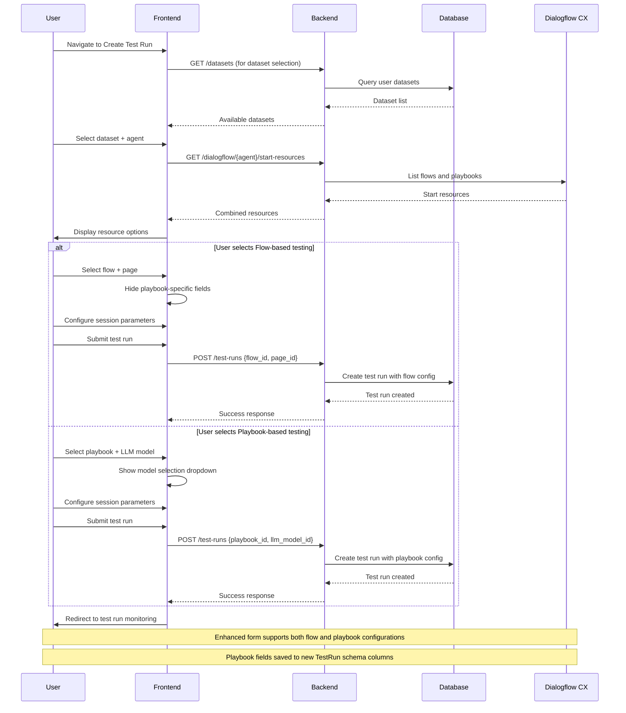
```mermaid
sequenceDiagram
    participant U as User
    participant FE as Frontend
    participant BE as Backend
    participant DB as Database
    participant DF as Dialogflow CX
    
    U->>FE: Navigate to Create Test Run
    FE->>BE: GET /datasets (for dataset selection)
    BE->>DB: Query user datasets
    DB-->>BE: Dataset list
    BE-->>FE: Available datasets
    
    U->>FE: Select dataset + agent
    FE->>BE: GET /dialogflow/{agent}/start-resources
    BE->>DF: List flows and playbooks
    DF-->>BE: Start resources
    BE-->>FE: Combined resources
    FE->>U: Display resource options
    
    alt User selects Flow-based testing
        U->>FE: Select flow + page
        FE->>FE: Hide playbook-specific fields
        U->>FE: Configure session parameters
        U->>FE: Submit test run
        FE->>BE: POST /test-runs {flow_id, page_id}
        BE->>DB: Create test run with flow config
        DB-->>BE: Test run created
        BE-->>FE: Success response
    else User selects Playbook-based testing
        U->>FE: Select playbook + LLM model
        FE->>FE: Show model selection dropdown
        U->>FE: Configure session parameters
        U->>FE: Submit test run
        FE->>BE: POST /test-runs {playbook_id, llm_model_id}
        BE->>DB: Create test run with playbook config
        DB-->>BE: Test run created
        BE-->>FE: Success response
    end
    
    FE->>U: Redirect to test run monitoring
    
    Note over U,DF: Enhanced form supports both flow and playbook configurations
    Note over U,DF: Playbook fields saved to new TestRun schema columns
```

## CSV Export Flow (Test Results)

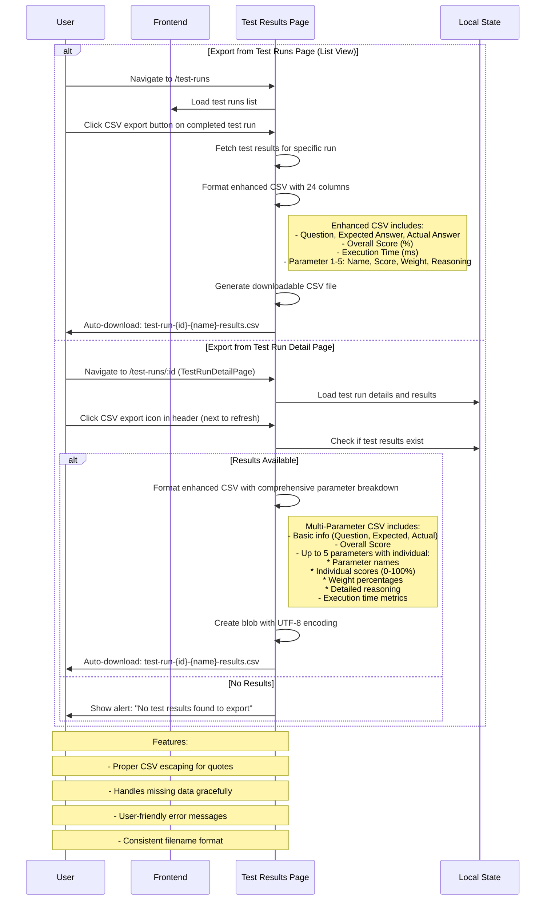
```mermaid
sequenceDiagram
    participant U as User
    participant FE as Frontend
    participant TestPage as Test Results Page
    participant State as Local State
    
    alt Export from Test Runs Page (List View)
        U->>TestPage: Navigate to /test-runs
        TestPage->>FE: Load test runs list
        U->>TestPage: Click CSV export button on completed test run
        TestPage->>TestPage: Fetch test results for specific run
        TestPage->>TestPage: Format enhanced CSV with 24 columns
        Note right of TestPage: Enhanced CSV includes:<br/>- Question, Expected Answer, Actual Answer<br/>- Overall Score (%)<br/>- Execution Time (ms)<br/>- Parameter 1-5: Name, Score, Weight, Reasoning
        TestPage->>TestPage: Generate downloadable CSV file
        TestPage->>U: Auto-download: test-run-{id}-{name}-results.csv
    
    else Export from Test Run Detail Page
        U->>TestPage: Navigate to /test-runs/:id (TestRunDetailPage)
        TestPage->>State: Load test run details and results
        U->>TestPage: Click CSV export icon in header (next to refresh)
        TestPage->>State: Check if test results exist
        
        alt Results Available
            TestPage->>TestPage: Format enhanced CSV with comprehensive parameter breakdown
            Note right of TestPage: Multi-Parameter CSV includes:<br/>- Basic info (Question, Expected, Actual)<br/>- Overall Score<br/>- Up to 5 parameters with individual:<br/>  * Parameter names<br/>  * Individual scores (0-100%)<br/>  * Weight percentages<br/>  * Detailed reasoning<br/>- Execution time metrics
            TestPage->>TestPage: Create blob with UTF-8 encoding
            TestPage->>U: Auto-download: test-run-{id}-{name}-results.csv
        
        else No Results
            TestPage->>U: Show alert: "No test results found to export"
        end
    end
    
    Note over U,TestPage: Features:
    Note over U,TestPage: - Proper CSV escaping for quotes
    Note over U,TestPage: - Handles missing data gracefully
    Note over U,TestPage: - User-friendly error messages
    Note over U,TestPage: - Consistent filename format
```

## Modern Navigation Flow (Arrow-Back Pattern)

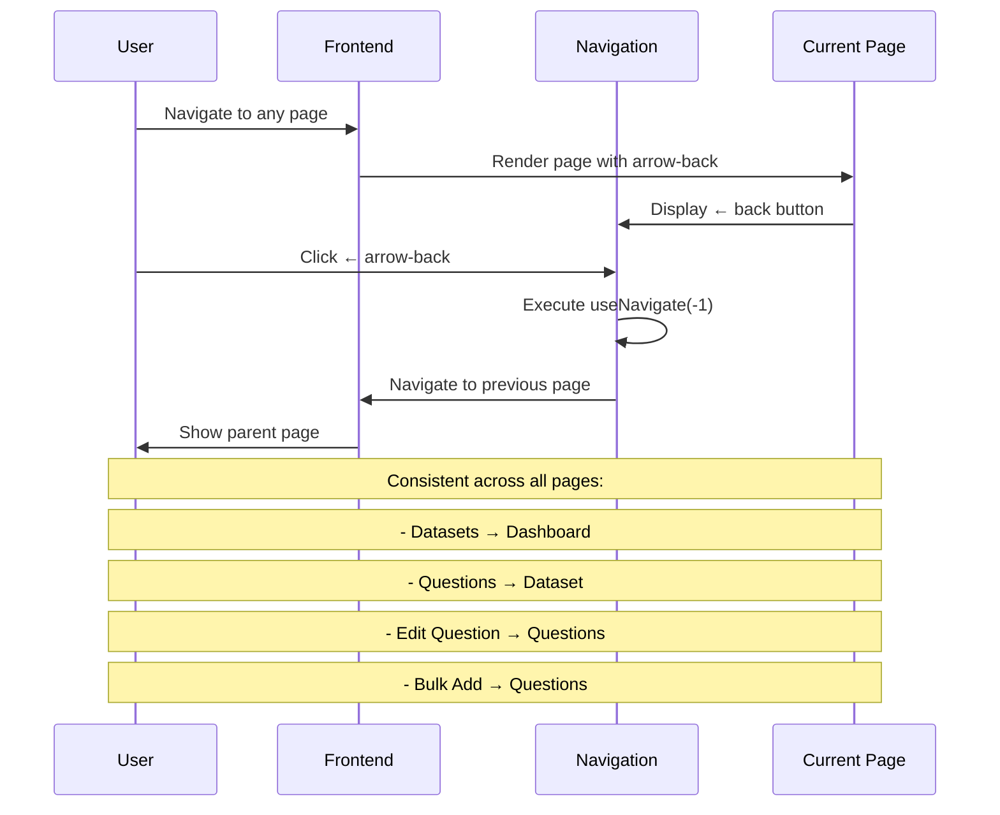
```mermaid
sequenceDiagram
    participant U as User
    participant FE as Frontend
    participant Nav as Navigation
    participant Page as Current Page
    
    U->>FE: Navigate to any page
    FE->>Page: Render page with arrow-back
    Page->>Nav: Display ← back button
    
    U->>Nav: Click ← arrow-back
    Nav->>Nav: Execute useNavigate(-1)
    Nav->>FE: Navigate to previous page
    FE->>U: Show parent page
    
    Note over U,Page: Consistent across all pages:
    Note over U,Page: - Datasets → Dashboard
    Note over U,Page: - Questions → Dataset
    Note over U,Page: - Edit Question → Questions
    Note over U,Page: - Bulk Add → Questions
```

## Question Editing Flow (Full-Screen)

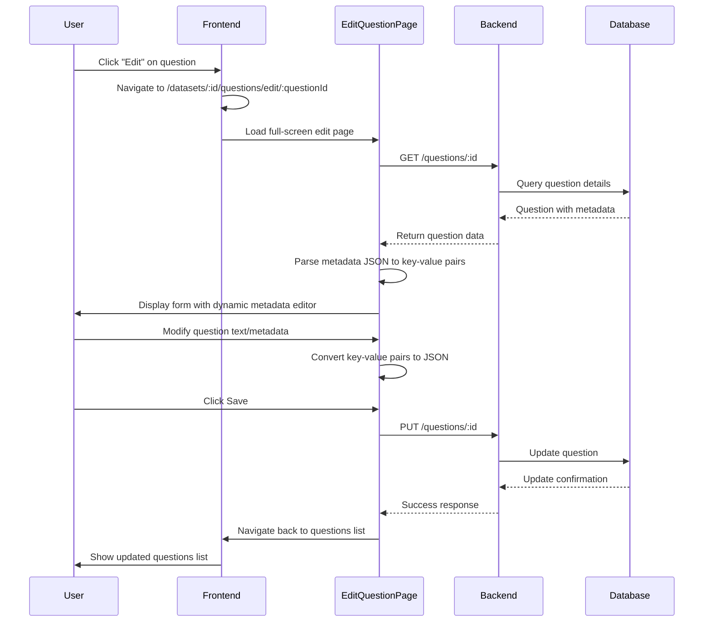
```mermaid
sequenceDiagram
    participant U as User
    participant FE as Frontend
    participant EditPage as EditQuestionPage
    participant BE as Backend
    participant DB as Database
    
    U->>FE: Click "Edit" on question
    FE->>FE: Navigate to /datasets/:id/questions/edit/:questionId
    FE->>EditPage: Load full-screen edit page
    EditPage->>BE: GET /questions/:id
    BE->>DB: Query question details
    DB-->>BE: Question with metadata
    BE-->>EditPage: Return question data
    
    EditPage->>EditPage: Parse metadata JSON to key-value pairs
    EditPage->>U: Display form with dynamic metadata editor
    
    U->>EditPage: Modify question text/metadata
    EditPage->>EditPage: Convert key-value pairs to JSON
    U->>EditPage: Click Save
    EditPage->>BE: PUT /questions/:id
    BE->>DB: Update question
    DB-->>BE: Update confirmation
    BE-->>EditPage: Success response
    EditPage->>FE: Navigate back to questions list
    FE->>U: Show updated questions list
```

## Enhanced Bulk Import Flow

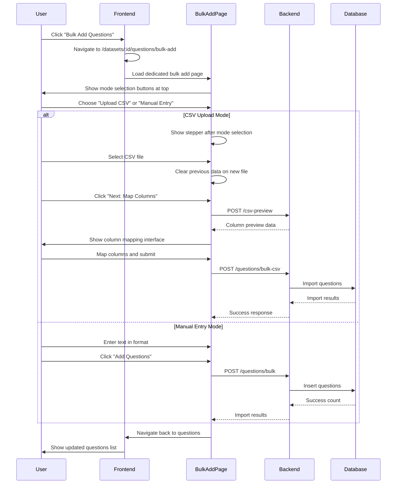
```mermaid
sequenceDiagram
    participant U as User
    participant FE as Frontend
    participant BulkPage as BulkAddPage
    participant BE as Backend
    participant DB as Database
    
    U->>FE: Click "Bulk Add Questions"
    FE->>FE: Navigate to /datasets/:id/questions/bulk-add
    FE->>BulkPage: Load dedicated bulk add page
    
    BulkPage->>U: Show mode selection buttons at top
    U->>BulkPage: Choose "Upload CSV" or "Manual Entry"
    
    alt CSV Upload Mode
        BulkPage->>BulkPage: Show stepper after mode selection
        U->>BulkPage: Select CSV file
        BulkPage->>BulkPage: Clear previous data on new file
        U->>BulkPage: Click "Next: Map Columns"
        BulkPage->>BE: POST /csv-preview
        BE-->>BulkPage: Column preview data
        BulkPage->>U: Show column mapping interface
        U->>BulkPage: Map columns and submit
        BulkPage->>BE: POST /questions/bulk-csv
        BE->>DB: Import questions
        DB-->>BE: Import results
        BE-->>BulkPage: Success response
    else Manual Entry Mode
        U->>BulkPage: Enter text in format
        U->>BulkPage: Click "Add Questions"
        BulkPage->>BE: POST /questions/bulk
        BE->>DB: Insert questions
        DB-->>BE: Success count
        BE-->>BulkPage: Import results
    end
    
    BulkPage->>FE: Navigate back to questions
    FE->>U: Show updated questions list
```

## Search and Filtering Flow

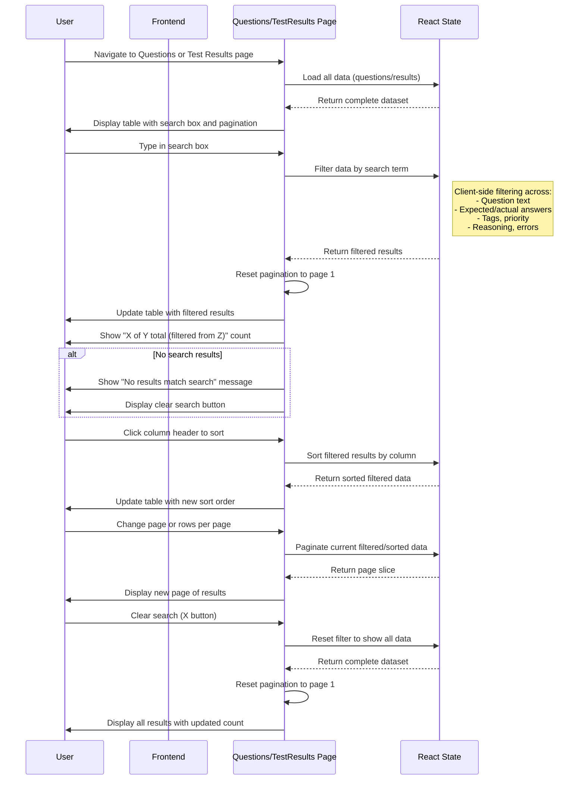
```mermaid
sequenceDiagram
    participant U as User
    participant FE as Frontend
    participant QPage as Questions/TestResults Page
    participant State as React State
    
    U->>QPage: Navigate to Questions or Test Results page
    QPage->>State: Load all data (questions/results)
    State-->>QPage: Return complete dataset
    QPage->>U: Display table with search box and pagination
    
    U->>QPage: Type in search box
    QPage->>State: Filter data by search term
    Note right of State: Client-side filtering across:<br/>- Question text<br/>- Expected/actual answers<br/>- Tags, priority<br/>- Reasoning, errors
    State-->>QPage: Return filtered results
    QPage->>QPage: Reset pagination to page 1
    QPage->>U: Update table with filtered results
    QPage->>U: Show "X of Y total (filtered from Z)" count
    
    alt No search results
        QPage->>U: Show "No results match search" message
        QPage->>U: Display clear search button
    end
    
    U->>QPage: Click column header to sort
    QPage->>State: Sort filtered results by column
    State-->>QPage: Return sorted filtered data
    QPage->>U: Update table with new sort order
    
    U->>QPage: Change page or rows per page
    QPage->>State: Paginate current filtered/sorted data
    State-->>QPage: Return page slice
    QPage->>U: Display new page of results
    
    U->>QPage: Clear search (X button)
    QPage->>State: Reset filter to show all data
    State-->>QPage: Return complete dataset
    QPage->>QPage: Reset pagination to page 1
    QPage->>U: Display all results with updated count
```

## Question Management Enhanced Flow

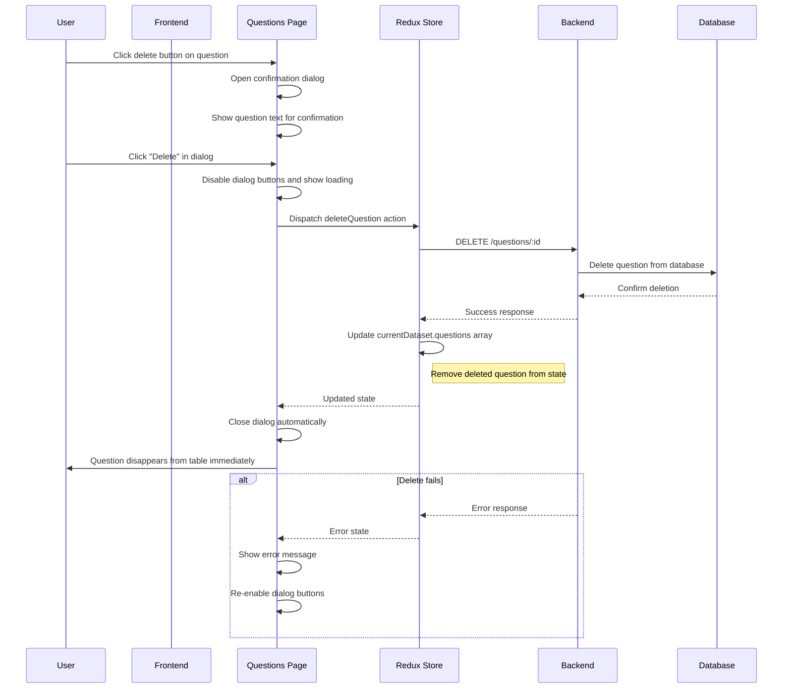
```mermaid
sequenceDiagram
    participant U as User
    participant FE as Frontend
    participant QPage as Questions Page
    participant Redux as Redux Store
    participant BE as Backend
    participant DB as Database
    
    U->>QPage: Click delete button on question
    QPage->>QPage: Open confirmation dialog
    QPage->>QPage: Show question text for confirmation
    
    U->>QPage: Click "Delete" in dialog
    QPage->>QPage: Disable dialog buttons and show loading
    QPage->>Redux: Dispatch deleteQuestion action
    Redux->>BE: DELETE /questions/:id
    BE->>DB: Delete question from database
    DB-->>BE: Confirm deletion
    BE-->>Redux: Success response
    Redux->>Redux: Update currentDataset.questions array
    Note right of Redux: Remove deleted question from state
    Redux-->>QPage: Updated state
    QPage->>QPage: Close dialog automatically
    QPage->>U: Question disappears from table immediately
    
    alt Delete fails
        BE-->>Redux: Error response
        Redux-->>QPage: Error state
        QPage->>QPage: Show error message
        QPage->>QPage: Re-enable dialog buttons
    end
```

## Dashboard User Attribution Flow

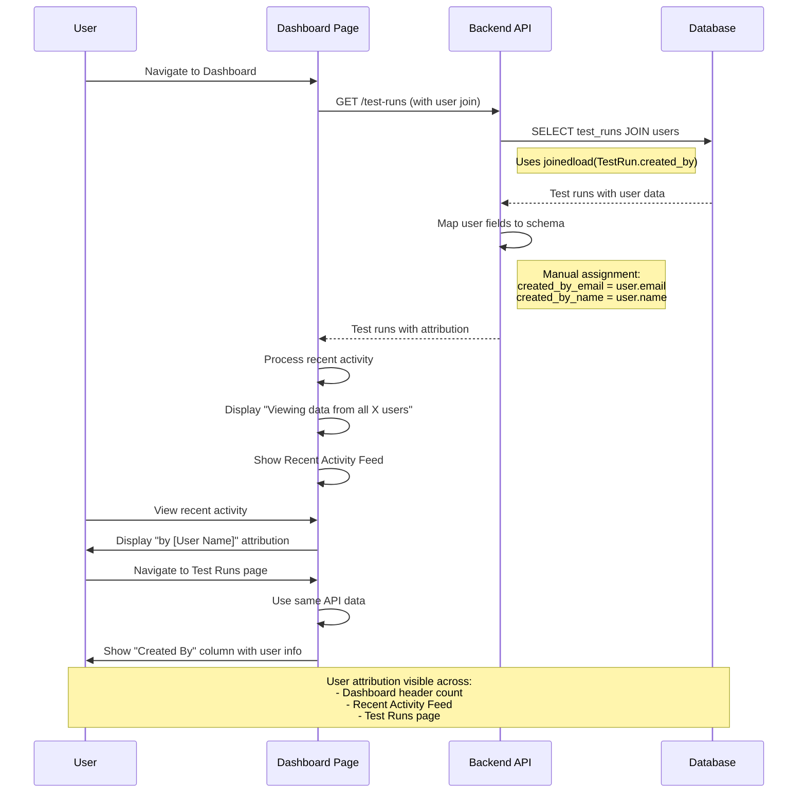
```mermaid
sequenceDiagram
    participant U as User
    participant Dashboard as Dashboard Page
    participant API as Backend API
    participant DB as Database
    
    U->>Dashboard: Navigate to Dashboard
    Dashboard->>API: GET /test-runs (with user join)
    API->>DB: SELECT test_runs JOIN users
    Note right of API: Uses joinedload(TestRun.created_by)
    DB-->>API: Test runs with user data
    API->>API: Map user fields to schema
    Note right of API: Manual assignment:<br/>created_by_email = user.email<br/>created_by_name = user.name
    API-->>Dashboard: Test runs with attribution
    
    Dashboard->>Dashboard: Process recent activity
    Dashboard->>Dashboard: Display "Viewing data from all X users"
    Dashboard->>Dashboard: Show Recent Activity Feed
    
    U->>Dashboard: View recent activity
    Dashboard->>U: Display "by [User Name]" attribution
    
    U->>Dashboard: Navigate to Test Runs page
    Dashboard->>Dashboard: Use same API data
    Dashboard->>U: Show "Created By" column with user info
    
    Note over U,DB: User attribution visible across:<br/>- Dashboard header count<br/>- Recent Activity Feed<br/>- Test Runs page
```

## Test Run Attribution Data Flow

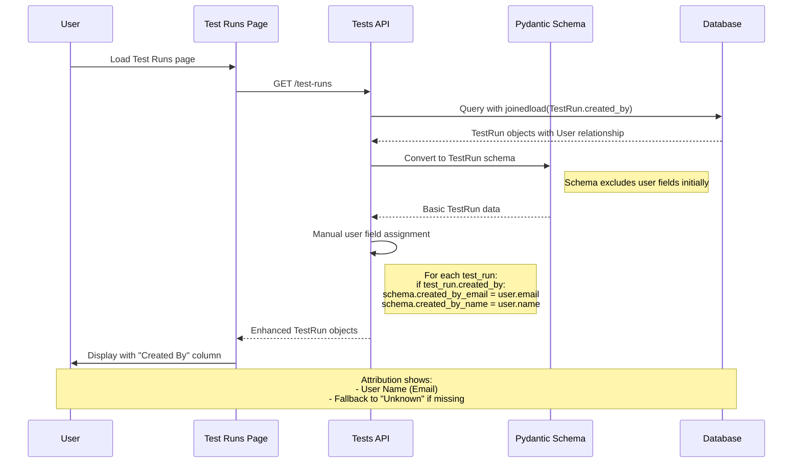
```mermaid
sequenceDiagram
    participant User as User
    participant TestRuns as Test Runs Page
    participant API as Tests API
    participant Schema as Pydantic Schema
    participant DB as Database
    
    User->>TestRuns: Load Test Runs page
    TestRuns->>API: GET /test-runs
    API->>DB: Query with joinedload(TestRun.created_by)
    DB-->>API: TestRun objects with User relationship
    
    API->>Schema: Convert to TestRun schema
    Note right of Schema: Schema excludes user fields initially
    Schema-->>API: Basic TestRun data
    
    API->>API: Manual user field assignment
    Note right of API: For each test_run:<br/>if test_run.created_by:<br/>  schema.created_by_email = user.email<br/>  schema.created_by_name = user.name
    
    API-->>TestRuns: Enhanced TestRun objects
    TestRuns->>User: Display with "Created By" column
    
    Note over User,DB: Attribution shows:<br/>- User Name (Email)<br/>- Fallback to "Unknown" if missing
```