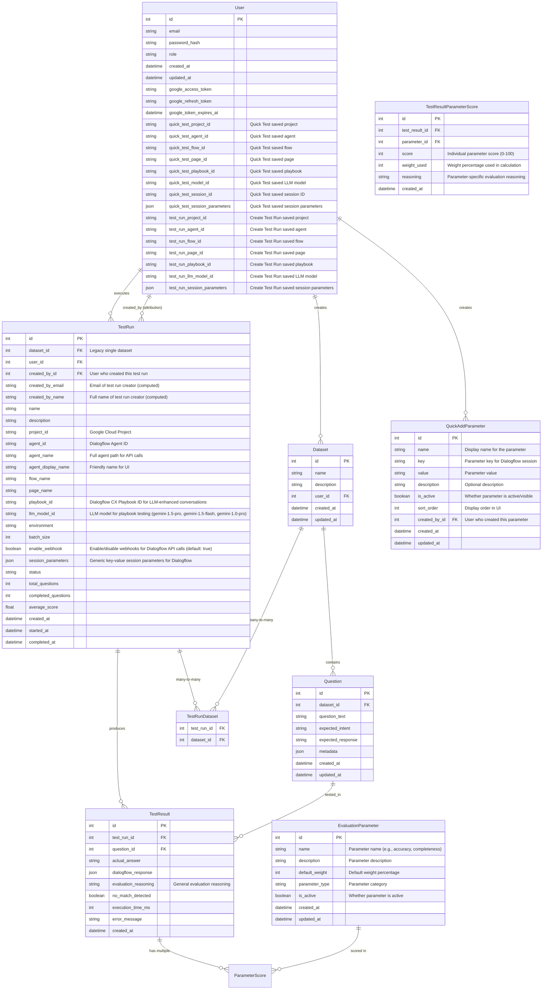
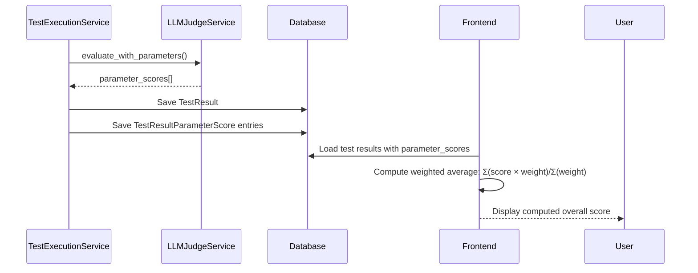
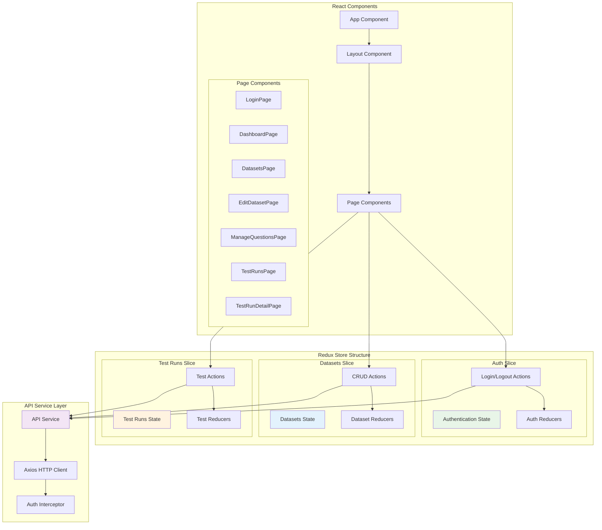

# Data Model and API Architecture - Dialogflow Test Suite

## Data Model Relationships



## Evaluation System Architecture (September 2025)

### Dynamic Parameter-Based Evaluation
The system uses a flexible dynamic parameter system:

```mermaid
graph LR
    subgraph "Dynamic Evaluation System" 
        PARAMETERS[Evaluation Parameters<br/>- Similarity Score (60%)<br/>- Empathy Level (30%)<br/>- No-Match Detection (10%)<br/>- Custom Parameters...]
        PARAMETERS -->|"individual scores"| PARAM_SCORES[TestResultParameterScore]
        PARAM_SCORES -->|"weighted calculation"| COMPUTED[Real-time<br/>Overall Score]
    end
    
    subgraph "Frontend Display"
        COMPUTED -->|"Σ(score × weight)/Σ(weight)"| UI_DISPLAY[ParameterScoreBreakdown<br/>Component]
    end
```

### Key Features
1. **Parameter-Based Scoring**: All evaluations use the `TestResultParameterScore` table
2. **Real-time Computation**: Frontend computes overall scores dynamically from parameter weights
3. **Unlimited Flexibility**: System supports unlimited custom evaluation parameters
4. **Configurable Weights**: Each parameter can have custom weight percentage

### Evaluation Flow


## API Architecture

```mermaid
graph TB
    subgraph "API Layer Structure"
        subgraph "Authentication"
            LOGIN[POST /auth/login]
            LOGOUT[POST /auth/logout]
            REFRESH[POST /auth/refresh]
        end
        
        subgraph "Dataset APIs"
            GET_DATASETS[GET /datasets]
            GET_DATASET[GET /datasets/:id]
            CREATE_DATASET[POST /datasets]
            UPDATE_DATASET[PUT /datasets/:id]
            DELETE_DATASET[DELETE /datasets/:id]
        end
        
        subgraph "Question APIs"
            GET_QUESTIONS[GET /datasets/:id/questions]
            CREATE_QUESTION[POST /datasets/:id/questions]
            BULK_QUESTIONS[POST /datasets/:id/questions/bulk]
            UPDATE_QUESTION[PUT /questions/:id]
            DELETE_QUESTION[DELETE /questions/:id]
        end
        
        subgraph "Test Execution APIs"
            CREATE_TEST[POST /test-runs]
            GET_TEST[GET /test-runs/:id]
            LIST_TESTS[GET /test-runs]
            TEST_RESULTS[GET /test-runs/:id/results]
        end
        
        subgraph "Session Parameters APIs"
            LIST_PARAMS[GET /quick-add-parameters]
            CREATE_PARAM[POST /quick-add-parameters]
            UPDATE_PARAM[PUT /quick-add-parameters/:id]
            DELETE_PARAM[DELETE /quick-add-parameters/:id]
        end
        
        subgraph "Dialogflow Integration"
            TEST_CONNECTION[POST /dialogflow/test-connection]
            RUN_QUERY[POST /dialogflow/query]
            START_RESOURCES[GET /dialogflow/{agent_name:path}/start-resources]
            QUICK_TEST[POST /dialogflow/{agent_name:path}/quick-test]
            LIST_PLAYBOOKS[GET /dialogflow/{agent_name:path}/playbooks]
        end
    end
    
    subgraph "Middleware Layer"
        AUTH_MW[JWT Authentication]
        CORS_MW[CORS Middleware]
        ERROR_MW[Error Handling]
        RATE_MW[Rate Limiting]
    end
    
    subgraph "Service Layer"
        AUTH_SVC[Authentication Service]
        DATASET_SVC[Dataset Service]
        DIALOGFLOW_SVC[Dialogflow Service]
        TEST_SVC[Test Execution Service]
        LLM_SVC[LLM Evaluation Service]
    end
    
    subgraph "Data Access Layer"
        USER_MODEL[User Model]
        DATASET_MODEL[Dataset Model]
        QUESTION_MODEL[Question Model]
        TEST_MODEL[Test Models]
    end
    
    LOGIN --> AUTH_MW
    GET_DATASETS --> AUTH_MW
    CREATE_DATASET --> AUTH_MW
    CREATE_TEST --> AUTH_MW
    
    AUTH_MW --> CORS_MW
    CORS_MW --> ERROR_MW
    ERROR_MW --> RATE_MW
    
    RATE_MW --> AUTH_SVC
    RATE_MW --> DATASET_SVC
    RATE_MW --> DIALOGFLOW_SVC
    RATE_MW --> TEST_SVC
    
    AUTH_SVC --> USER_MODEL
    DATASET_SVC --> DATASET_MODEL
    DATASET_SVC --> QUESTION_MODEL
    TEST_SVC --> TEST_MODEL
    TEST_SVC --> LLM_SVC
    DIALOGFLOW_SVC --> TEST_MODEL
    
    style LOGIN fill:#e8f5e8
    style GET_DATASETS fill:#e3f2fd
    style CREATE_TEST fill:#fff3e0
    style AUTH_MW fill:#f3e5f5
    style DATASET_SVC fill:#e1f5fe
```

## Frontend State Management



## Session Parameters Architecture

### Overview
The application supports flexible session parameters that can be passed to Dialogflow CX agents during testing. This replaces the previous hardcoded `user_type` field with a generic key-value approach.

### Data Structure
```json
{
  "session_parameters": {
    "userType": "employee",
    "environment": "prod",
    "department": "sales",
    "region": "northeast",
    "customParam": "customValue"
  }
}
```

### Database Schema
- **TestRun.session_parameters**: JSON field storing key-value pairs for test execution
- **User.quick_test_session_parameters**: JSON field storing user's Quick Test preferences

### Frontend Implementation
- **SessionParametersEditor Component**: Flexible key-value editor with quick-add presets
- **Quick Test Page**: Integrated session parameters configuration
- **Create Test Run Page**: Session parameters input for test execution
- **Auto-save**: User preferences automatically saved and restored

### Backend Implementation
- **Pydantic Schemas**: `session_parameters: Dict[str, str]` in request/response models
- **Dialogflow Service**: Passes session parameters to Dialogflow CX QueryParameters
- **API Endpoints**: Handle session parameters in Quick Test and Test Run creation
- **User Preferences**: Store/retrieve session parameters as JSON in user profile

### Migration Strategy
- Database migration from `user_type` string fields to `session_parameters` JSON fields
- Backward compatibility: `{"userType": "employee"}` maintains previous functionality
- Extensibility: Any new session parameters can be added without schema changes

## API Endpoints

### User Preferences Endpoints

#### Quick Test Preferences
- **GET** `/api/v1/auth/preferences/quick-test`
- **Description**: Retrieves user's saved Quick Test preferences
- **Response**: `QuickTestPreferences` object with saved project, agent, flow, page, playbook, and session parameter settings

- **PUT** `/api/v1/auth/preferences/quick-test`
- **Description**: Updates user's Quick Test preferences
- **Request Body**: `QuickTestPreferencesUpdate` object with preference fields to update
- **Response**: Updated `QuickTestPreferences` object

#### Test Run Preferences  
- **GET** `/api/v1/auth/preferences/test-run`
- **Description**: Retrieves user's saved Create Test Run preferences
- **Response**: `TestRunPreferences` object with saved project, agent, flow, page, playbook, and session parameter settings

- **PUT** `/api/v1/auth/preferences/test-run`
- **Description**: Updates user's Create Test Run preferences
- **Request Body**: `TestRunPreferencesUpdate` object with preference fields to update
- **Response**: Updated `TestRunPreferences` object

### Dialogflow Integration Endpoints

#### Start Resources
- **GET** `/dialogflow/{agent_name:path}/start-resources`
- **Description**: Retrieves available flows and playbooks for an agent
- **Path Parameters**: `agent_name` - Full agent resource name (supports slashes)
- **Response**: List of flows and playbooks with display names and resource IDs

#### Quick Test
- **POST** `/dialogflow/{agent_name:path}/quick-test`
- **Description**: Executes a single test query against an agent
- **Path Parameters**: `agent_name` - Full agent resource name (supports slashes)
- **Request Body**: `QuickTestRequest` with query text and optional playbook/flow configuration
- **Response**: Dialogflow response with fulfillment text and metadata

#### List Playbooks
- **GET** `/dialogflow/{agent_name:path}/playbooks`
- **Description**: Lists available playbooks for the specified agent
- **Path Parameters**: `agent_name` - Full agent resource name (supports slashes)
- **Response**: Array of playbook resources with names and display names

### Dashboard Analytics Endpoints

#### Dashboard Overview
- **GET** `/api/v1/dashboard/overview`
- **Description**: Retrieves key business metrics and overview statistics
- **Query Parameters**: `project_id` (optional) - Filter by Google Cloud project
- **Response**: Dashboard overview with total tests, average scores, success rates, and recent activity count

#### Performance Trends
- **GET** `/api/v1/dashboard/trends`
- **Description**: Gets performance trend data over time for charts and analysis
- **Query Parameters**: `project_id` (optional) - Filter by Google Cloud project
- **Response**: Time-series data for performance metrics with date-based grouping

#### Agent Performance
- **GET** `/api/v1/dashboard/agents`
- **Description**: Retrieves performance breakdown by individual Dialogflow agents
- **Query Parameters**: `project_id` (optional) - Filter by Google Cloud project
- **Response**: Agent-specific metrics including test counts, average scores, and performance comparisons

#### Recent Activity
- **GET** `/api/v1/dashboard/activity`
- **Description**: Gets recent test execution activity feed with user attribution
- **Query Parameters**: `project_id` (optional) - Filter by Google Cloud project
- **Response**: Chronological list of recent test runs with user, timestamp, and basic metrics

#### Parameter Performance
- **GET** `/api/v1/dashboard/parameters`
- **Description**: Analyzes evaluation parameter effectiveness across test runs
- **Query Parameters**: `project_id` (optional) - Filter by Google Cloud project
- **Response**: Parameter-specific performance metrics and effectiveness analysis

### Request/Response Schemas

#### TestResultResponse (Enhanced Multi-Parameter)
```json
{
  "id": "integer",
  "test_run_id": "integer",
  "question_id": "integer",
  "actual_answer": "string",
  "dialogflow_response": "object",
  "execution_time_ms": "integer",
  "error_message": "string (optional)",
  "parameter_scores": [
    {
      "id": "integer",
      "parameter_id": "integer",
      "parameter": {
        "name": "string",
        "description": "string"
      },
      "score": "integer (0-100)",
      "weight_used": "integer (percentage)",
      "reasoning": "string"
    }
  ],
  "created_at": "datetime"
}
```

#### EvaluationParameterResponse
```json
{
  "id": "integer",
  "name": "string",
  "description": "string",
  "default_weight": "integer",
  "parameter_type": "string",
  "is_active": "boolean",
  "created_at": "datetime",
  "updated_at": "datetime"
}
```

#### QuickTestPreferences
```json
{
  "project_id": "string (optional)",
  "agent_id": "string (optional)",
  "flow_id": "string (optional)",
  "page_id": "string (optional)",
  "playbook_id": "string (optional)",
  "llm_model_id": "string (optional)",
  "session_id": "string (optional)",
  "session_parameters": "object (optional)"
}
```

#### TestRunPreferences
```json
{
  "test_run_project_id": "string (optional)",
  "test_run_agent_id": "string (optional)",
  "test_run_flow_id": "string (optional)",
  "test_run_page_id": "string (optional)",
  "test_run_playbook_id": "string (optional)",
  "test_run_llm_model_id": "string (optional)",
  "test_run_session_parameters": "object (optional)"
}
```

#### QuickTestRequest
```json
{
  "query_text": "string",
  "flow_id": "string (optional)",
  "page_id": "string (optional)", 
  "playbook_id": "string (optional)",
  "llm_model_id": "string (optional)",
  "session_id": "string",
  "session_parameters": "object (optional)",
  "enable_webhook": "boolean (optional, default: true)"
}
```

#### CreateTestRunRequest
```json
{
  "dataset_id": "number",
  "name": "string",
  "agent_id": "string",
  "flow_id": "string (optional)",
  "page_id": "string (optional)",
  "playbook_id": "string (optional)",
  "llm_model_id": "string (optional)",
  "session_parameters": "object (optional)",
  "enable_webhook": "boolean (optional, default: true)"
}
```

#### DashboardOverviewResponse
```json
{
  "total_tests": "integer",
  "total_test_runs": "integer",
  "average_score": "number",
  "success_rate": "number",
  "recent_activity_count": "integer",
  "score_trend": "number",
  "success_trend": "number",
  "data_scope": "string (personal|system)"
}
```

#### DashboardTrendsResponse
```json
{
  "trends": [
    {
      "date": "string (YYYY-MM-DD)",
      "test_count": "integer",
      "average_score": "number",
      "success_rate": "number"
    }
  ]
}
```

#### AgentPerformanceResponse
```json
{
  "agents": [
    {
      "agent_id": "string",
      "agent_name": "string",
      "test_count": "integer",
      "average_score": "number",
      "success_rate": "number",
      "last_test_date": "datetime"
    }
  ]
}
```

#### RecentActivityResponse
```json
{
  "activities": [
    {
      "id": "integer",
      "test_run_name": "string",
      "user_email": "string",
      "agent_name": "string",
      "test_count": "integer",
      "average_score": "number",
      "status": "string",
      "created_at": "datetime",
      "completed_at": "datetime (optional)"
    }
  ]
}
```

#### ParameterPerformanceResponse
```json
{
  "parameters": [
    {
      "parameter_name": "string",
      "parameter_description": "string",
      "average_score": "number",
      "usage_count": "integer",
      "effectiveness_rating": "string (high|medium|low)"
    }
  ]
}
```