# Deployment and DevOps Architecture - Dialogflow Test Suite ✅ IMPLEMENTED

## ✅ Production CI/CD Pipeline - ACTIVE DEPLOYMENT

**Status**: Infrastructure deployed and operational  
**Project**: `your-gcp-project-id`  
**Database**: `dialogflow-tester-postgres-dev` (RUNNABLE)  
**GitHub Secrets**: Configured for automated deployment  

```mermaid
graph TB
    subgraph "GitHub Repository"
        MAIN_BRANCH[main branch]
        DEV_BRANCH[develop branch] 
        PR[Pull Request]
        ACTIONS[GitHub Actions ✅]
    end
    
    subgraph "Workload Identity Federation ✅ CONFIGURED"
        WIF_POOL[github-actions-pool]
        WIF_PROVIDER[github-provider]
        SERVICE_ACCOUNT[github-actions-dialogflow@your-gcp-project-id]
    end
    
    subgraph "Google Cloud Platform ✅ DEPLOYED"
        subgraph "Development Environment ✅ ACTIVE"
            DEV_CLOUD_RUN[Cloud Run Dev ✅ OPERATIONAL]
            DEV_CLOUD_SQL[Cloud SQL Dev ✅ OPERATIONAL]
            DEV_VPC[VPC Network ✅ CONFIGURED]
            DEV_FIREBASE[Firebase Hosting ✅ DEPLOYED]
        end
        
        subgraph "Production Environment 🚀 READY"
            PROD_CLOUD_RUN[Cloud Run Prod - Configured]
            PROD_CLOUD_SQL[Cloud SQL Prod - Configured]
            PROD_FIREBASE[Firebase Hosting - Ready]
        end
        
        TERRAFORM[Terraform State ✅ MANAGED]
    end
    
    subgraph "CI/CD Workflow ✅ IMPLEMENTED"
        BUILD[Build & Test Docker Images]
        DEPLOY_INFRA[Deploy Infrastructure ✅ DONE]
        DEPLOY_BACKEND[Deploy Backend to Cloud Run ✅ DEPLOYED]
        DEPLOY_FRONTEND[Deploy Frontend to Firebase ✅ DEPLOYED]
        HEALTH_CHECK[Health Checks ✅ PASSING]
    end
    
    MAIN_BRANCH --> ACTIONS
    DEV_BRANCH --> ACTIONS
    PR --> BUILD
    
    ACTIONS --> WIF_POOL
    WIF_POOL --> WIF_PROVIDER
    WIF_PROVIDER --> SERVICE_ACCOUNT
    
    SERVICE_ACCOUNT --> DEPLOY_INFRA
    SERVICE_ACCOUNT --> DEPLOY_BACKEND
    SERVICE_ACCOUNT --> DEPLOY_FRONTEND
    
    DEPLOY_INFRA --> DEV_CLOUD_SQL
    DEPLOY_INFRA --> DEV_VPC
    DEPLOY_INFRA --> TERRAFORM
    
    DEPLOY_BACKEND --> DEV_CLOUD_RUN
    DEPLOY_FRONTEND --> DEV_FIREBASE
    
    DEV_CLOUD_RUN --> HEALTH_CHECK
    DEV_FIREBASE --> HEALTH_CHECK
    
    HEALTH_CHECK --> DEV_CLOUD_SQL
```

## Current Infrastructure Status

### ✅ Deployed Components
- **Backend**: `https://dialogflow-tester-backend-dev-hs2q4zkodq-uc.a.run.app` (Cloud Run, HEALTHY)
- **Frontend**: `https://your-frontend-url.web.app` (Firebase Hosting)
- **Database**: `dialogflow-tester-postgres-dev` (PostgreSQL 15, VPC-connected)
- **Session Management**: In-memory sessions (cost-optimized, ~$26/month savings)
- **Networking**: VPC with subnet and connector (`df-tester-connector`)
- **Security**: Auto-generated database passwords, VPC isolation, OAuth integration
- **GitHub Integration**: Repository secrets configured for automation

### 🎯 Recent Optimizations (September 2025 - October 2025)
- **Cost Reduction**: Removed Redis cache infrastructure (~$26/month savings)
- **Architecture Simplification**: Migrated to in-memory session management
- **API Consistency**: Fixed frontend URL construction errors
- **Authentication Architecture**: 
  - **OAuth-First**: User authentication via Google OAuth (user's own credentials)
  - **Dynamic Model Discovery**: LLM models discovered via API, not hardcoded
  - **Removed Environment Variables**: `GEMINI_MODEL` and `GOOGLE_APPLICATION_CREDENTIALS` removed (unnecessary with OAuth-first approach)
  - **ADC Support**: Application Default Credentials (ADC) used automatically in GCP environments
- **Infrastructure as Code**: Implemented complete Terraform state management with resource imports
- **OAuth Automation**: Automated OAuth secret management via GitHub Actions TF_VAR variables
- **Environment Variables**: Fixed Vite environment variable precedence issues (.env.local override handling)
- **Deployment Pipeline**: Fully automated GitHub Actions workflow with Terraform and Firebase deployment
    
    SERVICE_ACCOUNT --> BUILD
    BUILD --> DEPLOY_INFRA
    DEPLOY_INFRA --> TERRAFORM
    TERRAFORM --> VPC
    
    VPC --> DEV_CLOUD_SQL
    VPC --> DEV_REDIS
    VPC --> PROD_CLOUD_SQL
    VPC --> PROD_REDIS
    
    DEPLOY_INFRA --> DEPLOY_APP
    DEPLOY_APP --> DEV_CLOUD_RUN
    DEPLOY_APP --> PROD_CLOUD_RUN
    DEPLOY_APP --> HEALTH_CHECK
    
    style WIF_POOL fill:#e8f5e8
    style SERVICE_ACCOUNT fill:#fff3e0
    style TERRAFORM fill:#e3f2fd
    style HEALTH_CHECK fill:#e1f5fe
```

## Security Architecture - Workload Identity Federation


## Docker Deployment Architecture


**Architecture Note**: This deployment uses **OAuth-first authentication**:
- ❌ **No service account JSON files** mounted to containers
- ❌ **No GOOGLE_APPLICATION_CREDENTIALS** environment variable needed
- ✅ **User OAuth credentials** from Google login provide authentication
- ✅ **ADC (Application Default Credentials)** automatically used in GCP environments
- ✅ **Optional GOOGLE_API_KEY** for development/testing without OAuth
```

## Complete Deployment Flow - All Targets


## GitHub Actions CI/CD Pipeline

```mermaid
graph TB
    subgraph "Trigger Events"
        PUSH_MAIN[Push to main]
        PUSH_DEV[Push to develop]
        PULL_REQUEST[Pull Request]
    end
    
    subgraph "Environment Detection"
        ENV_CHECK{Branch Check}
        SET_DEV[Environment: development]
        SET_PROD[Environment: production]
    end
    
    subgraph "Build & Test Stage"
        CHECKOUT[Checkout Code]
        NODE_SETUP[Setup Node.js]
        PYTHON_SETUP[Setup Python]
        INSTALL_DEPS[Install Dependencies]
        RUN_TESTS[Run Tests]
        BUILD_FRONTEND_STEP[Build Frontend Assets]
        BUILD_CONTAINERS[Build Backend Containers]
    end
    
    subgraph "Authentication"
        WIF_AUTH[Workload Identity Federation]
        GCP_AUTH[Authenticate to GCP]
    end
    
    subgraph "Infrastructure Deployment"
        TERRAFORM_INIT[terraform init]
        TERRAFORM_PLAN[terraform plan]
        TERRAFORM_APPLY[terraform apply]
    end
    
    subgraph "Application Deployment"
        subgraph "Frontend Deployment"
            BUILD_FRONTEND[Build React App]
            FIREBASE_DEPLOY[Deploy to Firebase Hosting]
            FRONTEND_LIVE[Frontend Live ✅]
        end
        
        subgraph "Backend Deployment"
            PUSH_IMAGES[Push Container Images]
            DEPLOY_CLOUD_RUN[Deploy to Cloud Run]
            BACKEND_LIVE[Backend Live ✅]
        end
        
        UPDATE_SECRETS[Update Application Secrets]
    end
    
    subgraph "Post-Deployment"
        HEALTH_CHECKS[Application Health Checks]
        SMOKE_TESTS[Smoke Tests]
        NOTIFY[Notify Team]
    end
    
    PUSH_MAIN --> ENV_CHECK
    PUSH_DEV --> ENV_CHECK
    PULL_REQUEST --> CHECKOUT
    
    ENV_CHECK -->|main| SET_PROD
    ENV_CHECK -->|develop| SET_DEV
    ENV_CHECK -->|PR| CHECKOUT
    
    SET_PROD --> CHECKOUT
    SET_DEV --> CHECKOUT
    
    CHECKOUT --> NODE_SETUP
    NODE_SETUP --> PYTHON_SETUP
    PYTHON_SETUP --> INSTALL_DEPS
    INSTALL_DEPS --> RUN_TESTS
    RUN_TESTS --> BUILD_FRONTEND_STEP
    BUILD_FRONTEND_STEP --> BUILD_CONTAINERS
    BUILD_CONTAINERS --> WIF_AUTH
    
    WIF_AUTH --> GCP_AUTH
    GCP_AUTH --> TERRAFORM_INIT
    TERRAFORM_INIT --> TERRAFORM_PLAN
    TERRAFORM_PLAN --> TERRAFORM_APPLY
    
    TERRAFORM_APPLY --> BUILD_FRONTEND
    TERRAFORM_APPLY --> PUSH_IMAGES
    
    BUILD_FRONTEND --> FIREBASE_DEPLOY
    FIREBASE_DEPLOY --> FRONTEND_LIVE
    
    PUSH_IMAGES --> DEPLOY_CLOUD_RUN
    DEPLOY_CLOUD_RUN --> BACKEND_LIVE
    
    FRONTEND_LIVE --> UPDATE_SECRETS
    BACKEND_LIVE --> UPDATE_SECRETS
    
    UPDATE_SECRETS --> HEALTH_CHECKS
    HEALTH_CHECKS --> SMOKE_TESTS
    SMOKE_TESTS --> NOTIFY
    
    style WIF_AUTH fill:#e8f5e8
    style GCP_AUTH fill:#fff3e0
    style TERRAFORM_APPLY fill:#e3f2fd
    style HEALTH_CHECKS fill:#e1f5fe
    style FIREBASE_DEPLOY fill:#ffeb3b
    style FRONTEND_LIVE fill:#4caf50
    style BACKEND_LIVE fill:#2196f3
```



## Multi-Environment Architecture

```mermaid
graph TB
    subgraph "Development Environment"
        DEV_PROJECT[your-gcp-project-id]
        
        subgraph "Dev Resources"
            DEV_CR[Cloud Run Dev ✅]
            DEV_SQL[db-f1-micro ✅]
            DEV_VPC[VPC Dev ✅]
            DEV_FIREBASE[Firebase Hosting ✅]
        end
    end
    
    subgraph "Production Environment"
        PROD_PROJECT[Production Project]
        
        subgraph "Prod Resources"
            PROD_CR[Cloud Run Prod]
            PROD_SQL[db-n1-standard-2]
            PROD_VPC[VPC Prod]
            PROD_FIREBASE[Firebase Hosting]
        end
    end
    
    subgraph "Shared Resources"
        ARTIFACT_REGISTRY[Artifact Registry]
        WIF_POOL[Workload Identity Pool]
        SERVICE_ACCOUNT[Service Account]
    end
    
    subgraph "GitHub Actions"
        WORKFLOW[deploy.yml]
        SECRETS[Repository Secrets]
    end
    
    WORKFLOW --> WIF_POOL
    SECRETS --> WIF_POOL
    WIF_POOL --> SERVICE_ACCOUNT
    SERVICE_ACCOUNT --> ARTIFACT_REGISTRY
    
    SERVICE_ACCOUNT --> DEV_PROJECT
    SERVICE_ACCOUNT --> PROD_PROJECT
    
    DEV_PROJECT --> DEV_CR
    DEV_PROJECT --> DEV_SQL
    DEV_PROJECT --> DEV_VPC
    DEV_PROJECT --> DEV_FIREBASE
    
    PROD_PROJECT --> PROD_CR
    PROD_PROJECT --> PROD_SQL
    PROD_PROJECT --> PROD_VPC
    PROD_PROJECT --> PROD_FIREBASE
    
    ARTIFACT_REGISTRY --> DEV_CR
    ARTIFACT_REGISTRY --> PROD_CR
    
    style DEV_PROJECT fill:#e8f5e8
    style PROD_PROJECT fill:#fff3e0
    style SERVICE_ACCOUNT fill:#e3f2fd
```



## Build and Deployment Pipeline


## Authentication & Authorization Architecture


### Authentication Priority Flow

**LLM Judge Service Authentication**:
1. **User OAuth (Preferred)**: Uses logged-in user's OAuth credentials
   - Scopes: `generative-language.retriever`, `dialogflow`
   - Respects user's GCP permissions
   - No API key needed
   
2. **API Key (Development)**: `GOOGLE_API_KEY` environment variable
   - Used when OAuth unavailable
   - Good for local testing
   - Limited to configured project
   
3. **ADC (Automatic)**: Application Default Credentials
   - Cloud Run: Service account automatically injected
   - Local: `gcloud auth application-default login`
   - No configuration needed

**Key Improvements**:
- ✅ **No hardcoded models**: Models discovered via Google Generative AI API
- ✅ **No service account files**: OAuth provides user-specific credentials  
- ✅ **Automatic ADC**: Works in GCP without environment variables
- ✅ **User-scoped access**: Users see only agents they have permission to access

## Environment Configuration


## API Configuration and Docker Networking

### Critical Configuration Patterns

**API Service Configuration** (`frontend/src/services/api.ts`):
```typescript
// ✅ CORRECT: Docker environment configuration
const api = axios.create({
  baseURL: '',  // Empty for relative URLs in Docker
  timeout: 10000,
  headers: {
    'Content-Type': 'application/json',
  },
});

// ✅ CORRECT: API endpoints with proper trailing slashes
const endpoints = {
  // Collection endpoints MUST have trailing slash for FastAPI
  datasets: '/api/v1/datasets/',      // ✅ Correct
  testRuns: '/api/v1/test-runs/',     // ✅ Correct
  
  // Individual resource endpoints without trailing slash
  dataset: (id: number) => `/api/v1/datasets/${id}`,     // ✅ Correct
  testRun: (id: number) => `/api/v1/test-runs/${id}`,    // ✅ Correct
};

// ❌ INCORRECT: Hardcoded localhost URLs
baseURL: 'http://localhost:8000',  // ❌ Wrong for Docker

// ❌ INCORRECT: Missing trailing slashes on collection endpoints
datasets: '/api/v1/datasets',      // ❌ Causes 307 redirects
testRuns: '/api/v1/test-runs',      // ❌ Causes 307 redirects
```

### Docker Port Mapping Architecture


### Nginx Proxy Configuration

**Frontend Container** (`frontend/nginx.conf`):
```nginx
# Proxy API requests to backend container
location /api/ {
    proxy_pass http://backend:8000;
    proxy_set_header Host $host;
    proxy_set_header X-Real-IP $remote_addr;
}

# Serve React static files
location / {
    try_files $uri $uri/ /index.html;
}
```

### FastAPI Trailing Slash Requirements

**Critical Rule**: FastAPI collection endpoints require trailing slashes to avoid 307 redirects.

| Endpoint Type | Correct Format | Result |
|---------------|----------------|---------|
| Collection (List/Create) | `/api/v1/datasets/` | ✅ Direct 200 response |
| Collection (List/Create) | `/api/v1/datasets` | ❌ 307 redirect → slower |
| Individual Resource | `/api/v1/datasets/123` | ✅ Direct 200 response |
| Individual Resource | `/api/v1/datasets/123/` | ✅ Also works |

### Debugging Docker API Issues

**Check Container Connectivity**:
```bash
# Verify containers are running
docker-compose ps

# Check frontend container logs
docker-compose logs frontend

# Check backend container logs  
docker-compose logs backend

# Test internal API connectivity from frontend container
docker-compose exec frontend curl http://backend:8000/api/v1/datasets/

# Test external API access from host
curl http://localhost:8000/api/v1/datasets/
```

**Common Configuration Issues**:

1. **Wrong baseURL in api.ts**:
   - ❌ `baseURL: 'http://localhost:8000'` (hardcoded)
   - ✅ `baseURL: ''` (relative URLs)

2. **Missing trailing slashes**:
   - ❌ `/api/v1/datasets` → 307 redirect
   - ✅ `/api/v1/datasets/` → 200 direct

3. **Nginx proxy misconfiguration**:
   - Verify `proxy_pass http://backend:8000` points to correct container
   - Check Docker Compose service names match

4. **Container networking issues**:
   - Ensure both services are on same Docker network
   - Verify service names in docker-compose.yml

### Development vs Production Configuration

| Environment | Frontend Access | Backend Access | API BaseURL |
|-------------|----------------|----------------|-------------|
| **Development** | localhost:3000 | localhost:8000 | `''` (relative) |
| **Docker Local** | localhost:3000 | localhost:8000 | `''` (relative) |
| **Production** | domain.com | domain.com/api | `''` (relative) |

**Key Principle**: Always use relative URLs (`baseURL: ''`) so the frontend automatically adapts to its hosting environment.

## Monitoring and Observability

