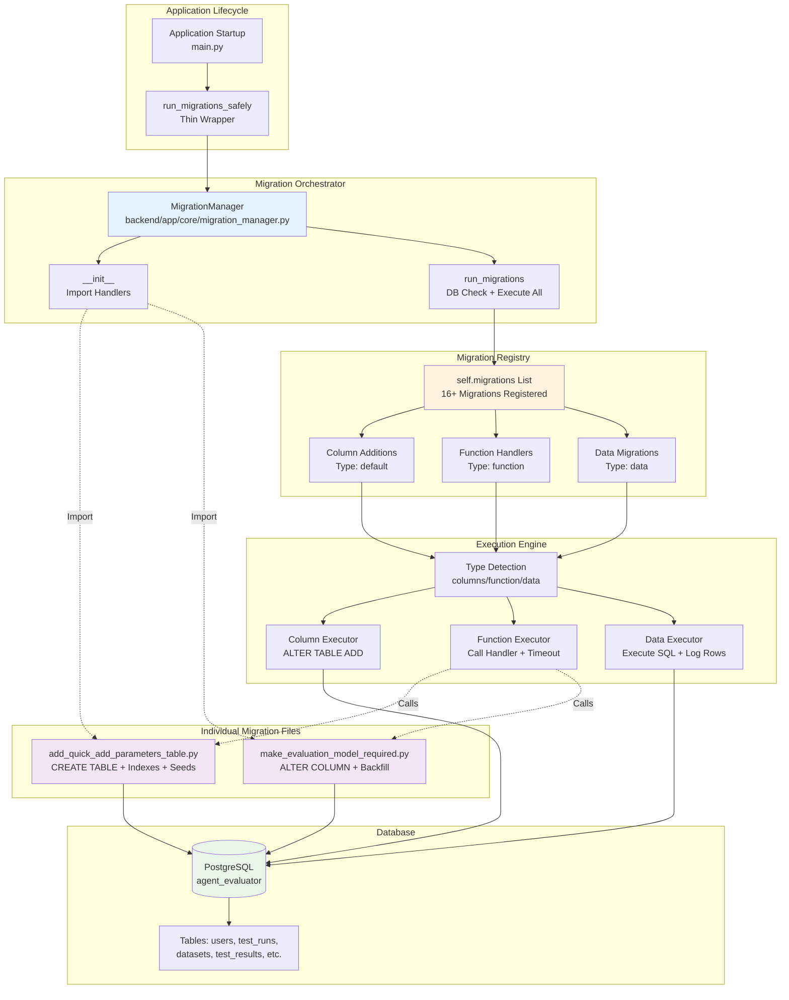
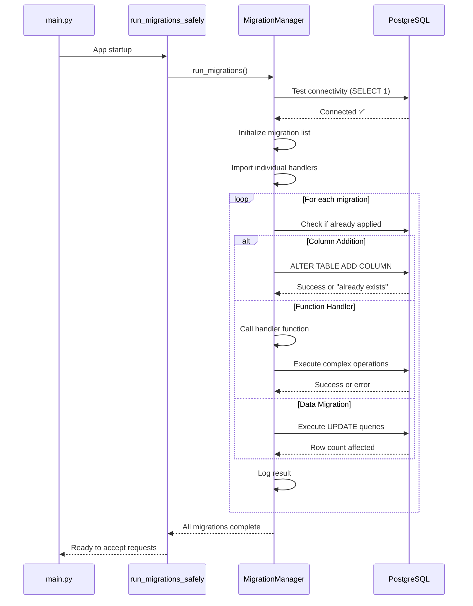

# Database Migration System - Dialogflow Test Suite

## Overview

The Dialogflow Test Suite uses a **unified migration system** that orchestrates all database schema changes through a single entry point. This system supports three types of migrations to handle everything from simple column additions to complex table creation and data backfills.

## Architecture



## Simplified Architecture

The migration system was deliberately designed with **minimal layers**:

**Two Functions, Clear Separation:**
1. **`run_migrations_safely()` in `main.py`**: 
   - Thin wrapper that catches only truly critical errors
   - Filters out acceptable errors (permission denied, already exists)
   - This is the entry point called during app startup

2. **`MigrationManager.run_migrations()` in `migrations.py`**:
   - Does ALL the actual work: connectivity check, migration execution, error handling
   - Built-in database connectivity verification before running migrations
   - Comprehensive error handling with detailed logging
   - This is where all the intelligence lives

**Why This Design?**
- ✅ **Single Source of Truth**: All migration logic in `MigrationManager`
- ✅ **Testable**: Can test migrations independently by calling `run_migrations()` directly
- ✅ **Reusable**: Migration system works standalone or from any entry point
- ✅ **Simple**: Thin wrapper in `main.py` just filters critical vs non-critical errors

## Migration Types

### 1. Column Additions (Default Type)

**Purpose**: Simple `ALTER TABLE ADD COLUMN` operations  
**Location**: Inline in `MigrationManager.migrations` list  
**Use Case**: Adding new nullable columns to existing tables

**Pattern:**
```python
{
    'name': 'add_google_oauth_tokens',
    'description': 'Add Google OAuth token columns',
    'columns': [
        ('users', 'google_access_token', 'TEXT'),
        ('users', 'google_refresh_token', 'TEXT'),
        ('users', 'google_token_expires_at', 'TIMESTAMP')
    ]
}
```

**Execution:**
- Checks if column exists using SQLAlchemy inspector
- Executes `ALTER TABLE {table} ADD COLUMN {column} {type}` if not exists
- Logs "✅ Column already exists" or "✅ Added column"
- Gracefully handles "already exists" errors

### 2. Function Handlers (Complex Operations)

**Purpose**: Complex operations that can't be inline SQL  
**Location**: Individual files in `backend/app/core/migration_files/`  
**Use Case**: CREATE TABLE, indexes, constraints, multi-step operations

**Pattern:**
```python
# In migration_files/create_new_feature.py
from sqlalchemy import text
from app.core.database import engine

def upgrade():
    """Create new feature table with indexes"""
    with engine.connect() as connection:
        connection.execute(text("""
            CREATE TABLE IF NOT EXISTS new_feature (
                id SERIAL PRIMARY KEY,
                name TEXT NOT NULL,
                created_at TIMESTAMP DEFAULT NOW()
            )
        """))
        connection.execute(text("""
            CREATE INDEX IF NOT EXISTS idx_new_feature_name 
            ON new_feature(name)
        """))
        connection.commit()

# In migrations.py
from app.core.migration_files.create_new_feature import upgrade as create_new_feature

# In MigrationManager.__init__
self.migrations = [
    {
        'name': 'create_new_feature_table',
        'description': 'Create new feature table with indexes',
        'type': 'function',
        'handler': create_new_feature,
        'timeout': 60  # Optional: timeout in seconds
    }
]
```

**Execution:**
- Calls the imported function handler
- Supports optional timeout using threading
- If timeout specified, runs handler in separate thread and monitors
- Logs "⚠️ Migration timed out" if exceeds timeout
- Propagates any exceptions from handler

**When to Use:**
- ✅ Creating new tables
- ✅ Adding indexes or constraints
- ✅ Complex data transformations requiring multiple queries
- ✅ Operations that need to be reusable across environments
- ✅ Inserting seed data

### 3. Data Migrations (SQL Lists)

**Purpose**: Simple UPDATE queries for data backfills  
**Location**: Inline in `MigrationManager.migrations` list  
**Use Case**: Setting default values, fixing NULL data, one-off updates

**Pattern:**
```python
{
    'name': 'backfill_test_run_progress_fields',
    'description': 'Set default values for total_questions and completed_questions in existing test runs',
    'type': 'data',
    'sql': [
        "UPDATE test_runs SET total_questions = 0 WHERE total_questions IS NULL",
        "UPDATE test_runs SET completed_questions = 0 WHERE completed_questions IS NULL"
    ]
}
```

**Execution:**
- Checks if first table mentioned exists
- Executes each SQL statement in order
- Logs "✅ Updated X rows" for each statement that affects data
- Commits after each statement
- Skips if table doesn't exist

**When to Use:**
- ✅ Backfilling NULL values in existing rows
- ✅ Setting default values after adding required fields to Pydantic schemas
- ✅ One-off data fixes or cleanup
- ✅ Simple UPDATE queries without complex logic

## Key Design Decisions

### Why Three Types?

1. **Column Additions**: Most common operation, benefits from simplified inline syntax
2. **Function Handlers**: Complex operations need full Python control and reusability
3. **Data Migrations**: Simple backfills don't justify separate files

### Why Unified Orchestrator?

**Before (Dual System - Confusing):**
- Individual migration files manually imported in `main.py`
- Inline SQL scattered in startup functions
- No clear pattern for adding migrations
- Hard to track what migrations exist

**After (Unified System - Clear):**
- Single `MigrationManager.run_migrations()` call in `main.py`
- All migrations registered in one list
- Clear patterns for each migration type
- Easy to see entire migration history

### Why Keep Individual Files?

**Critical for Fresh Deployments:**
- When deploying to a new environment (e.g., new GCP project), the database starts empty
- Individual migration files contain table creation logic (CREATE TABLE)
- Without these files, new deployments would fail with missing tables
- Files are reusable and version-controlled

**Example:** `add_quick_add_parameters_table.py` creates the `quick_add_parameters` table. If we inline this as SQL strings in `migrations.py`, it works for existing environments but makes fresh deployments harder to maintain.

## Migration Flow

### Startup Sequence



### Error Handling

The system gracefully handles:

1. **"Already Exists" Errors**: Skips and logs "✅ Already exists"
2. **Permission Errors**: Logs warning and continues
3. **Missing Tables**: Skips data migrations for non-existent tables
4. **Timeouts**: Logs warning and continues with other migrations
5. **Unknown Errors**: Catches and logs, doesn't crash app startup

## Adding New Migrations

### For Simple Column Addition

```python
# Edit: backend/app/core/migration_manager.py
# Add to MigrationManager.migrations list:

{
    'name': 'add_new_feature_columns',
    'description': 'Add columns for new feature',
    'columns': [
        ('table_name', 'new_column', 'TEXT'),
        ('table_name', 'another_column', 'INTEGER DEFAULT 0')
    ]
}
```

### For Complex Operation

```python
# Step 1: Create backend/app/core/migration_files/add_new_table.py
from sqlalchemy import text
from app.core.database import engine

def upgrade():
    """Create new table"""
    with engine.connect() as connection:
        connection.execute(text("""
            CREATE TABLE IF NOT EXISTS new_table (
                id SERIAL PRIMARY KEY,
                data TEXT
            )
        """))
        connection.commit()

# Step 2: Edit backend/app/core/migration_manager.py
# Add import in MigrationManager.__init__:
from app.core.migration_files.add_new_table import upgrade as add_new_table

# Step 3: Add to migrations list:
{
    'name': 'create_new_table',
    'description': 'Create new table',
    'type': 'function',
    'handler': add_new_table,
    'timeout': None  # or 60 for timeout
}
```

### For Data Backfill

```python
# Edit: backend/app/core/migration_manager.py
# Add to MigrationManager.migrations list:

{
    'name': 'backfill_new_column',
    'description': 'Set default values for new column',
    'type': 'data',
    'sql': [
        "UPDATE table_name SET new_column = 'default' WHERE new_column IS NULL"
    ]
}
```

## Critical Rules

### 1. ⚠️ ALWAYS Add Data Migrations When Making Fields Required

**Problem**: Pydantic default values (e.g., `int = 0`) do NOT apply to existing NULL database values during validation.

**Solution**: Add data migration to backfill NULL values before new code expects them.

```python
# When adding required field to Pydantic schema:
class TestRun(BaseModel):
    total_questions: int = 0  # This default is for NEW instances only!

# MUST add data migration:
{
    'name': 'backfill_total_questions',
    'type': 'data',
    'sql': ["UPDATE test_runs SET total_questions = 0 WHERE total_questions IS NULL"]
}
```

### 2. 🚫 NEVER Delete Old Migration Files

**Why**: Fresh deployments to new environments need table creation logic.

**What to Do**: Keep all migration files in `migration_files/` directory forever.

### 3. ✅ Test Migrations Locally First

**Process**:
1. Make changes locally
2. Rebuild Docker: `docker compose build backend`
3. Start containers: `docker compose up -d backend`
4. Check logs: `docker compose logs backend | Select-String -Pattern "migration"`
5. Verify all migrations completed successfully

### 4. 📝 Use Descriptive Names and Descriptions

**Good**:
```python
{
    'name': 'add_session_parameters',
    'description': 'Add session parameters support for test runs'
}
```

**Bad**:
```python
{
    'name': 'update_table',
    'description': 'Add columns'
}
```

### 5. 🔄 Migrations Are Idempotent

**Design Principle**: All migrations must be safe to run multiple times.

**Implementation**:
- Column additions: Check if exists before adding
- Table creation: Use `CREATE TABLE IF NOT EXISTS`
- Data updates: Use WHERE clauses to only affect relevant rows
- Indexes: Use `CREATE INDEX IF NOT EXISTS`

## Debugging Migrations

### View Migration Logs

```powershell
# All migration logs
docker compose logs backend | Select-String -Pattern "migration"

# Specific migration
docker compose logs backend | Select-String -Pattern "backfill"

# Row counts from data migrations
docker compose logs backend | Select-String -Pattern "Updated.*rows"
```

### Common Issues

**Issue**: "ImportError: cannot import name 'run_migrations'"  
**Cause**: Python importing from `migrations/` package folder instead of `migrations.py` module  
**Solution**: Folder renamed to `migration_files/` to avoid conflict

**Issue**: Data migration shows 0 rows updated  
**Cause**: Rows already have correct values (expected in local dev)  
**Solution**: Will update actual rows in production GCP where old data exists

**Issue**: Column already exists  
**Cause**: Migration already applied (idempotent design working correctly)  
**Solution**: No action needed, this is expected behavior

**Issue**: Migration timeout  
**Cause**: Operation taking longer than timeout seconds  
**Solution**: Increase timeout value or remove timeout for no limit

## Production Deployment

### GCP Cloud Run Behavior

**Startup Sequence:**
1. GitHub Actions builds Docker image
2. Image pushed to Artifact Registry
3. Cloud Run creates new revision
4. Container starts, runs `main.py`
5. `run_migrations_safely()` calls `MigrationManager.run_migrations()`
6. Migration system checks database connectivity, then runs all migrations
7. If migrations fail with critical error, container startup fails
8. If migrations succeed, app accepts traffic

**Migration Execution in Production:**
- All migrations run automatically on every deployment
- Idempotent design means re-running is safe
- Data migrations will UPDATE actual rows (unlike local dev with fresh data)
- Logs visible in Cloud Run console under "Logs" tab

### Monitoring Migration Success

```bash
# View Cloud Run logs for migrations
gcloud run services logs read dialogflow-tester-backend-dev \
  --region=us-central1 \
  --limit=100 | grep migration

# Check for errors
gcloud run services logs read dialogflow-tester-backend-dev \
  --region=us-central1 \
  --limit=100 | grep -E "error|Error|ERROR"
```

## File Locations

**Core Migration System:**
- `backend/app/core/migration_manager.py` - MigrationManager orchestrator
- `backend/app/core/migration_files/` - Individual migration files directory
- `backend/app/main.py` - Startup calls `run_migrations_safely()`

**Current Individual Migration Files:**
- `backend/app/core/migration_files/add_quick_add_parameters_table.py` - Creates quick_add_parameters table
- `backend/app/core/migration_files/make_evaluation_model_required.py` - Makes evaluation_model_id NOT NULL

**Documentation:**
- `.github/copilot-instructions.md` - Developer instructions (lines 240-294)
- `design/migration-system.md` - This file (architectural overview)
- `design/system-architecture.md` - High-level system design (includes migration diagram)
- `README.md` - User-facing documentation (quick reference)

## Future Enhancements

**Potential Improvements:**
1. **Migration Tracking Table**: Create `schema_migrations` table to track applied migrations by name
2. **Rollback Support**: Add `downgrade()` functions for reversible migrations
3. **Dry Run Mode**: Add flag to preview migrations without executing
4. **Migration Generator**: CLI tool to scaffold new migration files
5. **Dependency Management**: Allow migrations to declare dependencies on other migrations

**Current State**: Basic but effective system that handles all current needs without over-engineering.
