# Direct Routing Architecture - Dialogflow Test Suite

## React Router Navigation Flow

```mermaid
graph TB
    subgraph "Application Routes"
        ROOT["/ - Root"]
        LOGIN["/login - LoginPage"]
        DASHBOARD["/dashboard - DashboardPage"]
        DATASETS["/datasets - DatasetsPage"]
        EDIT_DATASET["/datasets/:id/edit - EditDatasetPage"]
        MANAGE_QUESTIONS["/datasets/:id/questions - ManageQuestionsPage"]
        EDIT_QUESTION["/datasets/:id/questions/edit/:questionId - EditQuestionPage"]
        BULK_ADD["/datasets/:id/questions/bulk-add - BulkAddQuestionsPage"]
        QUICK_TEST["/quick-test - QuickTestPage"]
        TEST_RUNS["/test-runs - TestRunsPage"]
        SESSION_PARAMS["/session-parameters - SessionParametersPage"]
        TEST_DETAIL["/test-runs/:id - TestRunDetailPage"]
    end
    
    subgraph "Navigation Patterns (Arrow-Back Style)"
        subgraph "Dataset Management Flow"
            DATASETS --> EDIT_DATASET
            DATASETS --> MANAGE_QUESTIONS
            EDIT_DATASET -.->|← Back| DATASETS
            MANAGE_QUESTIONS -.->|← Back| DATASETS
        end
        
        subgraph "Question Management Flow"
            MANAGE_QUESTIONS --> EDIT_QUESTION
            MANAGE_QUESTIONS --> BULK_ADD
            EDIT_QUESTION -.->|← Back| MANAGE_QUESTIONS
            BULK_ADD -.->|← Back| MANAGE_QUESTIONS
        end
        
        subgraph "Test Execution Flow"
            DATASETS --> TEST_RUNS
            DASHBOARD --> QUICK_TEST
            TEST_RUNS --> TEST_DETAIL
            TEST_DETAIL -.->|← Back| TEST_RUNS
            QUICK_TEST -.->|← Back| DASHBOARD
        end
        
        subgraph "Authentication Flow"
            ROOT --> LOGIN
            LOGIN --> DASHBOARD
            DASHBOARD --> DATASETS
            DASHBOARD --> TEST_RUNS
        end
    end
    
    subgraph "Direct Access URLs"
        DIRECT1["http://localhost:3000/datasets/1/edit"]
        DIRECT2["http://localhost:3000/datasets/1/questions"]
        DIRECT3["http://localhost:3000/datasets/1/questions/edit/456"]
        DIRECT4["http://localhost:3000/datasets/1/questions/bulk-add"]
        DIRECT5["http://localhost:3000/test-runs/123"]
    end
    
    DIRECT1 --> EDIT_DATASET
    DIRECT2 --> MANAGE_QUESTIONS
    DIRECT3 --> EDIT_QUESTION
    DIRECT4 --> BULK_ADD
    DIRECT5 --> TEST_DETAIL
    
    style EDIT_DATASET fill:#e8f5e8
    style EDIT_QUESTION fill:#e8f5e8
    style BULK_ADD fill:#e8f5e8
    style MANAGE_QUESTIONS fill:#e3f2fd
    style DIRECT1 fill:#fff3e0
    style DIRECT2 fill:#fff3e0
    style DIRECT3 fill:#fff3e0
```



## Component State Management in Direct Routes


## Navigation Component Architecture


## Protected Route Implementation


## Modern Arrow-Back Navigation Pattern

### **Navigation Philosophy**
The application has transitioned from breadcrumb-based navigation to a modern arrow-back pattern for improved UX:

```mermaid
graph LR
    subgraph "Old Pattern (Breadcrumbs)"
        B1["Home > Datasets > Questions > Edit"]
        B2["Complex hierarchy display"]
        B3["Multiple click targets"]
    end
    
    subgraph "New Pattern (Arrow-Back)"
        A1["← Edit Question"]
        A2["Single intuitive back action"]
        A3["Clean minimal interface"]
    end
    
    B1 -.->|Replaced by| A1
    B2 -.->|Simplified to| A2
    B3 -.->|Reduced to| A3
```



### **Arrow-Back Implementation**
All pages now use consistent arrow-back navigation with `useNavigate(-1)`:

- **DatasetsPage**: `← Back` to Dashboard
- **EditDatasetPage**: `← Back` to Datasets
- **ManageQuestionsPage**: `← Back` to Datasets  
- **EditQuestionPage**: `← Back` to Questions
- **BulkAddQuestionsPage**: `← Back` to Questions
- **TestRunDetailPage**: `← Back` to Test Runs

## 🚨 **CRITICAL NAVIGATION STANDARDS** 🚨

### **Mandatory Back Arrow Navigation**
**ALL pages deeper than base navigation MUST include back arrow navigation:**

```tsx
// REQUIRED PATTERN for all detail/sub-pages
const SomeDetailPage: React.FC = () => {
  const navigate = useNavigate();
  
  return (
    <Box sx={{ p: 3 }}>
      {/* MANDATORY: Back button header */}
      <Box sx={{ display: 'flex', alignItems: 'center', mb: 3 }}>
        <IconButton onClick={() => navigate('/parent-route')} sx={{ mr: 2 }}>
          <ArrowBackIcon />
        </IconButton>
        <Typography variant="h4" component="h1" sx={{ flexGrow: 1 }}>
          Page Title
        </Typography>
      </Box>
      
      {/* Page content */}
    </Box>
  );
};
```

## 🚨 **CRITICAL API DATA LOADING PATTERNS** 🚨

### **Use Redux for Detail Pages (REQUIRED)**
**ALL detail pages MUST use Redux patterns to avoid API baseURL issues:**

```tsx
// ❌ AVOID: Direct API calls in detail components
const loadData = async () => {
  const data = await apiService.getSomeData(id); // Can cause baseURL issues
};

// ✅ REQUIRED: Use Redux thunks and store selectors
const SomeDetailPage: React.FC = () => {
  const dispatch = useAppDispatch();
  const { items } = useAppSelector((state) => state.someSlice);
  const targetItem = items.find(item => item.id === parseInt(id || '0'));

  useEffect(() => {
    // If no data in store, load all items (uses working API patterns)
    if (items.length === 0) {
      dispatch(fetchAllItems()); // This works reliably
    }
  }, [dispatch, items.length]);
};
```

### **API Loading Strategy for Direct URL Navigation**
When users navigate directly to detail URLs (e.g., `/test-runs/4`):

1. **Check Redux store first** - if parent data exists, use it
2. **Load parent collection** - use `fetchAllItems()` instead of `fetchSingleItem(id)`
3. **Find target item** - extract from loaded collection
4. **Display immediately** - no additional API calls needed

```tsx
// PROVEN PATTERN - TestRunDetailPage implementation
useEffect(() => {
  if (testRuns.length === 0) {
    // Load all test runs (reliable API call)
    dispatch(fetchTestRuns());
  } else {
    // Find target test run from loaded data
    loadTestRun(); // Only if needed for refresh
  }
}, [id, dispatch, testRuns.length]);
```

### **Why This Pattern is Required**
- **Problem**: Single-item API endpoints can hit wrong ports (localhost:80 instead of localhost:3000)
- **Root Cause**: Axios baseURL configuration issues in Docker/production environments
- **Solution**: Use collection endpoints that work reliably, then filter in memory
- **Benefit**: Faster loading (data often cached) + eliminates baseURL issues

### **Navigation Hierarchy Enforcement**
```
Dashboard (BASE)
├── Datasets (BASE)
│   ├── Edit Dataset (DETAIL - needs ← back)
│   └── Manage Questions (DETAIL - needs ← back)
│       ├── Edit Question (SUB-DETAIL - needs ← back)
│       └── Bulk Add (SUB-DETAIL - needs ← back)
├── Test Runs (BASE)
│   ├── Create Test Run (DETAIL - needs ← back)
│   └── Test Run Detail (DETAIL - needs ← back)
└── Quick Test (BASE)
```

### **Required Imports for Navigation**
```tsx
import { useNavigate } from 'react-router-dom';
import { IconButton, Box } from '@mui/material';
import ArrowBackIcon from '@mui/icons-material/ArrowBack';
```

### **Navigation State Persistence**
- Store parent context in sessionStorage for complex flows
- Preserve filter/search state when returning to parent
- Handle direct URL access gracefully (no parent context)

### **Enhanced Route Structure**
New routes added for comprehensive question management:

| Route | Component | Purpose | Navigation |
|-------|-----------|---------|------------|
| `/datasets/:id/questions/edit/:questionId` | EditQuestionPage | Full-screen question editing | ← to Questions |
| `/datasets/:id/questions/bulk-add` | BulkAddQuestionsPage | Bulk import interface | ← to Questions |

### **Dynamic Metadata Editing**
The EditQuestionPage implements a revolutionary metadata editing experience:
- **Input**: Raw JSON metadata from database
- **Transform**: Dynamic key-value pair interface
- **Output**: Validated JSON back to database
- **UX**: Individual add/remove controls for each metadata field