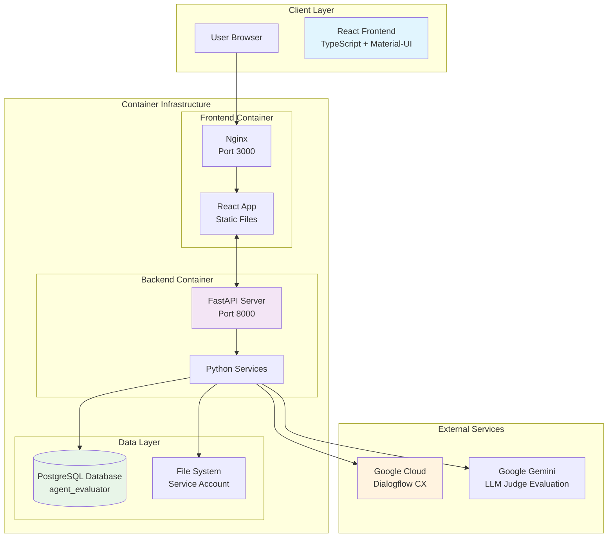
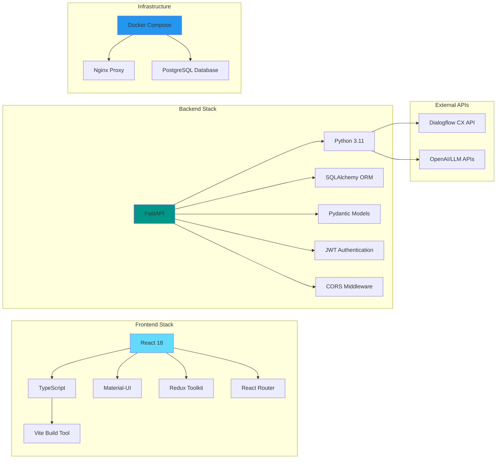
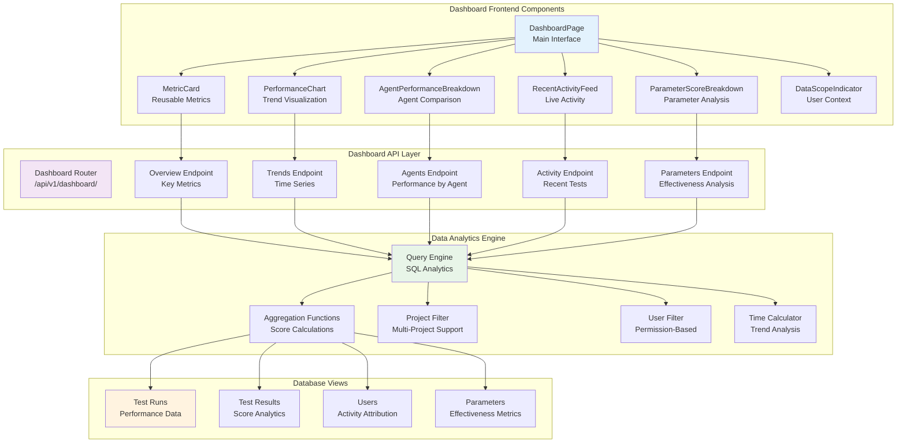
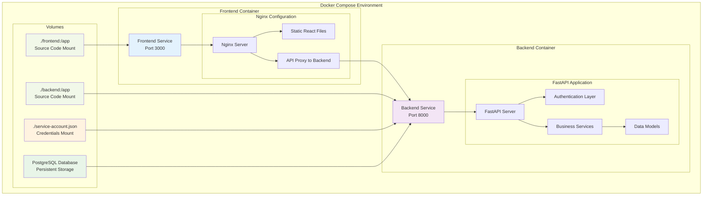
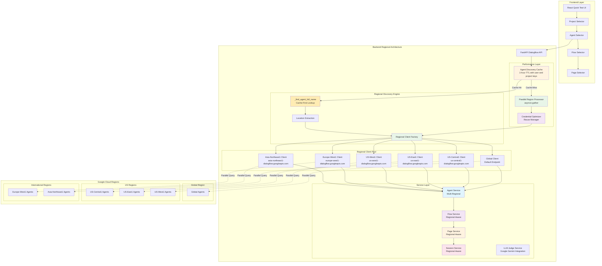
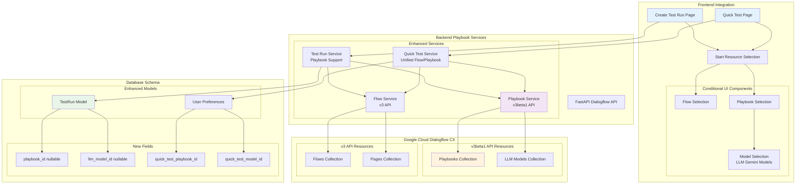

# System Architecture - Dialogflow Test Suite

## High-Level System Architecture



## Technology Stack



## Dashboard Analytics Architecture

**Latest Enhancement (Sept 2025)**: Comprehensive business dashboard with analytics, performance metrics, and stakeholder insights.



## Container Architecture



## Multi-Regional Dialogflow Architecture

**Latest Enhancement (Sept 12, 2025)**: Comprehensive multi-regional architecture for Dialogflow CX integration across all Google Cloud regions with advanced performance optimizations.



### Regional Architecture Components

#### 1. **Performance Optimization Layer**
- **Agent Discovery Cache**: Global in-memory cache with TTL-based expiration
- **Parallel Region Processor**: Concurrent execution of region searches using `asyncio.gather()`
- **Credential Optimizer**: Single credential creation and reuse across operations
- **Cache-First Strategy**: Prioritizes cached results for sub-second responses

#### 2. **Regional Discovery Engine**
- **`_find_agent_full_name()`**: Cache-first lookup with parallel search fallback
- **Location Extraction**: Parses agent paths to determine regional context
- **Regional Client Factory**: Creates appropriate regional clients based on location

#### 3. **Regional Client Pool**
- **Dynamic Creation**: Clients created on-demand for each region
- **Endpoint Configuration**: Automatic regional endpoint routing
- **Global Fallback**: Special handling for global region agents
- **Credential Management**: OAuth token validation per regional client

#### 4. **Performance Metrics**
- **First Load**: 5-6x faster through parallel processing (seconds → sub-second)
- **Subsequent Loads**: Near-instant response from cache (milliseconds)
- **Cache Hit Rate**: High efficiency for repeated project access
- **Memory Usage**: Minimal overhead with metadata-only caching
- **API Rate Limiting**: Reduced exposure through intelligent caching

#### 5. **Regional Service Architecture**
```python
# Core Regional Methods
async def _get_regional_flows_client(location: str) -> FlowsClient
async def _get_regional_pages_client(location: str) -> PagesClient  
async def _get_regional_sessions_client(location: str) -> SessionsClient

# Discovery and Resolution
async def _find_agent_full_name(agent_id: str) -> str
def _extract_location_from_agent_name(agent_name: str) -> str
def _extract_location_from_flow_name(flow_name: str) -> str

# Performance Optimizations
async def _list_agents_by_locations() -> List[Dict[str, str]]  # Parallel search
async def _search_agents_in_location() -> List[Dict[str, str]]  # Individual location
async def _find_agent_in_location() -> Optional[str]           # Optimized discovery
def clear_agent_cache()                                        # Cache management
```

#### 6. **Cache Architecture**
```python
# Cache Structure
_agent_cache = {
    (user_id, project_id): {
        "agents": [...],
        "timestamp": 1694563200.0,
        "ttl": 3600
    }
}

# Cache Strategy
- Key Format: (user_id, project_id) for user isolation
- TTL: 3600 seconds (1 hour) for balance of performance and freshness
- Memory Efficient: Metadata only, not full objects
- Automatic Expiration: Time-based invalidation
- Manual Clearing: clear_agent_cache() for forced refresh
```

#### 4. **Supported Regions and Endpoints**
| Region | Endpoint |
|--------|----------|
| global | Default dialogflow.googleapis.com |
| us-central1 | us-central1-dialogflow.googleapis.com |
| us-east1 | us-east1-dialogflow.googleapis.com |
| us-west1 | us-west1-dialogflow.googleapis.com |
| europe-west1 | europe-west1-dialogflow.googleapis.com |
| asia-northeast1 | asia-northeast1-dialogflow.googleapis.com |

#### 7. **Optimized Regional Workflow**
1. **Cache Check**: Verify agent cache for instant response (cache hit = ~10ms)
2. **Parallel Discovery**: If cache miss, search all regions concurrently (5-6x faster)
3. **Location Resolution**: Determine agent's specific region from response
4. **Client Creation**: Create regional client for agent's location
5. **Cache Update**: Store results for future requests (1-hour TTL)
6. **Flow/Page Loading**: Use location-specific clients for related resources
7. **Quick Testing**: Route sessions through correct regional client

**Performance Workflow Benefits**:
- **Cache Hit Path**: user request → cache lookup → instant response
- **Cache Miss Path**: user request → parallel API calls → aggregated response → cache update
- **Subsequent Requests**: Near-instant responses from cached data
- **Resource Efficiency**: Minimal memory footprint with intelligent TTL management

This multi-regional architecture with performance optimizations ensures seamless operation across all Google Cloud regions while maintaining optimal performance through parallel processing, intelligent caching, and efficient resource utilization.

## Dialogflow CX Playbooks Architecture

**Latest Enhancement (Oct 2024)**: Comprehensive Dialogflow CX Playbooks support integrated across the test automation platform.



### Playbook Architecture Components

#### 1. **Dual Resource Support**
- **Traditional Flows**: Dialogflow CX v3 API with flows and pages
- **Playbooks**: Dialogflow CX v3beta1 API with LLM-powered conversational AI
- **Unified Interface**: Single start resource selection supporting both types
- **Regional Clients**: Both FlowsClient and PlaybooksClient with regional endpoints

#### 2. **Frontend Integration**
- **Conditional UI**: Dynamic rendering based on selected resource type
- **Model Selection**: LLM model dropdown appears for playbook selection
- **User Preferences**: Separate quick test preferences for flows and playbooks
- **Form Validation**: Enhanced validation supporting playbook-specific fields

#### 3. **Backend API Enhancements**
- **Enhanced Endpoints**: `/start-resources`, `/quick-test`, `/playbooks` with path parameters
- **Resource Discovery**: Unified listing of flows and playbooks from respective APIs
- **Query Execution**: Smart routing between flow pages and playbook queries
- **Schema Support**: Extended request/response models with playbook fields

#### 4. **Database Schema Extensions**
- **TestRun Model**: Added `playbook_id` and `llm_model_id` nullable fields
- **User Preferences**: Added `quick_test_playbook_id` and `quick_test_model_id`
- **Migration Support**: Unified migration system with MigrationManager orchestration (see [migration-system.md](migration-system.md) for details)
- **Data Integrity**: Proper relationships and constraints for playbook data

#### 5. **Testing Workflow Integration**
- **Quick Testing**: Supports both flow/page and playbook/model combinations
- **Test Run Creation**: Full playbook support in bulk testing workflows
- **Session Management**: Enhanced session parameters for playbook contexts
- **Result Processing**: Unified response handling for both resource types

This playbook architecture seamlessly integrates Dialogflow CX's latest conversational AI capabilities while maintaining full backward compatibility with existing flow-based testing workflows.

## 🚨 **CRITICAL FRONTEND API PATTERNS** 🚨

### **Required Redux Data Loading Patterns**

**Problem**: Direct API calls from detail components can fail due to axios baseURL issues in Docker/production environments, causing requests to hit `http://localhost:80` instead of `http://localhost:3000` (nginx proxy).

**Solution**: Always use Redux store patterns for detail pages that mirror successful list pages.

### **Proven Pattern Implementation**

```tsx
// ✅ WORKING PATTERN - List pages (e.g., TestRunsPage)
const TestRunsPage: React.FC = () => {
  const dispatch = useAppDispatch();
  const { testRuns, loading, error } = useAppSelector((state) => state.testRuns);

  useEffect(() => {
    dispatch(fetchTestRuns()); // ✅ This works reliably
  }, [dispatch]);
};

// ✅ REQUIRED PATTERN - Detail pages (e.g., TestRunDetailPage)
const TestRunDetailPage: React.FC = () => {
  const dispatch = useAppDispatch();
  const { testRuns } = useAppSelector((state) => state.testRuns);
  const testRun = testRuns.find(run => run.id === parseInt(id || '0'));

  useEffect(() => {
    // Load parent collection if not available
    if (testRuns.length === 0) {
      dispatch(fetchTestRuns()); // ✅ Use working collection endpoint
    }
  }, [dispatch, testRuns.length]);
};
```

### **Why This Pattern is Critical**

1. **Collection endpoints work reliably** - `fetchTestRuns()`, `fetchDatasets()`, etc.
2. **Single-item endpoints can fail** - axios baseURL issues cause wrong port targeting
3. **Memory efficiency** - Data shared between list and detail views
4. **Performance** - Often faster than individual API calls
5. **Consistency** - Same data loading patterns across the application

### **Implementation Rules**

- ✅ **DO**: Use `fetchAllItems()` then filter in memory
- ✅ **DO**: Check Redux store before making API calls
- ✅ **DO**: Use `useAppSelector` to find specific items
- ❌ **AVOID**: Direct `apiService.getItem(id)` calls in detail components
- ❌ **AVOID**: Custom axios configurations or baseURL overrides

### **Debugging Failed API Calls**

If you see `GET http://localhost/api/...` (port 80) instead of `http://localhost:3000/api/...`:

1. **Root cause**: axios baseURL configuration issue
2. **Quick fix**: Switch to Redux collection loading pattern
3. **Long-term**: All detail pages should use this pattern consistently

## Webhook Control Architecture

**Latest Enhancement (Oct 2025)**: Comprehensive webhook enable/disable functionality for both Quick Test and Test Runs with proper Dialogflow CX API integration.

```mermaid
graph TB
    subgraph "Frontend Layer - Webhook Controls"
        QT[Quick Test Page<br/>Material-UI Switch]
        TR[Create Test Run Page<br/>Material-UI Switch]
        WS[Webhook State<br/>enableWebhook: boolean]
    end
    
    subgraph "API Layer - Webhook Configuration"
        QTR[QuickTestRequest<br/>enable_webhook: true (default)]
        CTR[CreateTestRunRequest<br/>enable_webhook: true (default)]
        API[FastAPI Backend<br/>Webhook Parameter Processing]
    end
    
    subgraph "Service Layer - Dialogflow Integration"
        DS[DialogflowService<br/>enable_webhook parameter]
        DI[detect_intent()<br/>QueryParameters.disable_webhook]
        QTS[quick_test()<br/>QueryParameters.disable_webhook]
        BDI[batch_detect_intent()<br/>QueryParameters.disable_webhook]
    end
    
    subgraph "Database Layer"
        DB[(TestRun Model<br/>enable_webhook: boolean)]
        MIG[Database Migration<br/>ALTER TABLE test_runs<br/>ADD enable_webhook BOOLEAN DEFAULT TRUE]
    end
    
    subgraph "Dialogflow CX API"
        DFX[Dialogflow CX<br/>QueryParameters]
        WH[Webhook Execution<br/>Conditional Based on disable_webhook]
    end
    
    QT --> WS
    TR --> WS
    WS --> QTR
    WS --> CTR
    QTR --> API
    CTR --> API
    
    API --> DS
    DS --> DI
    DS --> QTS
    DS --> BDI
    
    API --> DB
    DB --> MIG
    
    DI --> DFX
    QTS --> DFX
    BDI --> DFX
    DFX --> WH
    
    style QT fill:#e3f2fd
    style TR fill:#e3f2fd
    style DS fill:#f3e5f5
    style DB fill:#e8f5e8
    style DFX fill:#fff3e0
```

### **Webhook Control Flow**

1. **User Interface**: Material-UI Switch components provide webhook enable/disable toggle
2. **Default State**: Webhooks are enabled by default (enable_webhook: true)
3. **API Integration**: Frontend passes webhook preference in QuickTestRequest/CreateTestRunRequest
4. **Service Processing**: DialogflowService methods receive enable_webhook parameter
5. **Dialogflow API**: QueryParameters.disable_webhook = not enable_webhook sent to Dialogflow CX
6. **Database Persistence**: Test runs store webhook preference for replay and analysis

### **Implementation Details**

- **Boolean Logic**: Frontend `enable_webhook` becomes `QueryParameters.disable_webhook = not enable_webhook`
- **Backward Compatibility**: Existing test runs default to webhook enabled
- **Per-Test Configuration**: Each test execution can independently control webhook usage
- **Type Safety**: Full TypeScript integration with proper schema validation across all layers

## User Attribution Architecture

**Feature Enhancement (December 2024)**: Comprehensive user attribution system providing visibility into test creation and activity across the application.

```mermaid
graph TB
    subgraph "Frontend User Attribution"
        TRP[TestRunsPage<br/>Created By Column]
        RAF[RecentActivityFeed<br/>User Attribution Display]
        UI[User Interface<br/>created_by_name, created_by_email]
    end
    
    subgraph "API Layer - User Data Loading"
        API[Tests API Endpoint<br/>list_test_runs()]
        JOIN[SQLAlchemy Joinedload<br/>TestRun.created_by relationship]
        MAP[Manual Field Mapping<br/>Post-schema conversion]
    end
    
    subgraph "Database Layer - User Relationships"
        TR[TestRun Model<br/>created_by_id (FK)]
        USR[User Model<br/>id, name, email]
        REL[Foreign Key Relationship<br/>TestRun → User]
    end
    
    subgraph "Schema Layer - Data Transfer"
        TS[TestRun Schema<br/>created_by_email, created_by_name]
        VAL[Schema Validation<br/>No auto-override validators]
    end
    
    TRP --> UI
    RAF --> UI
    UI --> API
    
    API --> JOIN
    JOIN --> REL
    REL --> TR
    REL --> USR
    
    API --> MAP
    MAP --> TS
    TS --> VAL
    
    style TRP fill:#e3f2fd
    style RAF fill:#e3f2fd
    style API fill:#f3e5f5
    style TR fill:#e8f5e8
    style USR fill:#e8f5e8
```

### **User Attribution Features**

1. **Test Runs Attribution**: "Created By" column shows user name and email for each test run
2. **Dashboard Activity**: Recent activity feed displays user attribution with "by [User Name]" format
3. **User Context**: Dashboard header shows "Viewing data from all X users" with meaningful user count
4. **Default Handling**: Graceful fallback to "Unknown" when user data is unavailable

### **Implementation Details**

- **Database Relationships**: Proper foreign key relationship between TestRun and User models
- **Efficient Loading**: Uses SQLAlchemy `joinedload()` to prevent N+1 query problems
- **Schema Design**: Manual field population after Pydantic conversion to avoid validator conflicts
- **Type Safety**: Full TypeScript integration with proper interface definitions
- **Fallback Handling**: Robust error handling for missing or deleted user records

### **Technical Architecture**

- **Frontend Types**: Enhanced TestRun interface with `created_by_email` and `created_by_name` fields
- **API Strategy**: Load user relationships with joinedload, then manually populate schema fields
- **Schema Approach**: Removed auto-validating model validators that were overriding manual assignments
- **User Experience**: Consistent user attribution display across Test Runs page and Dashboard components